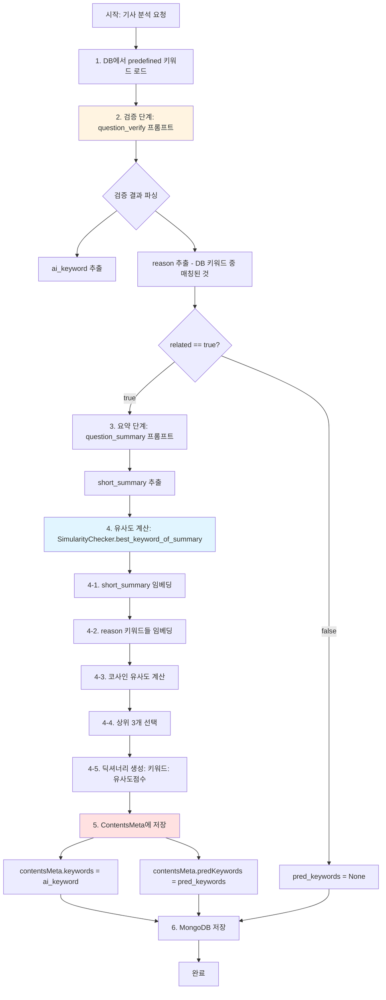
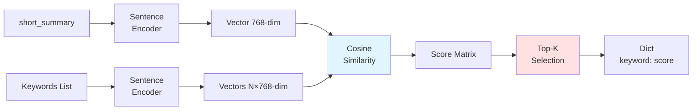
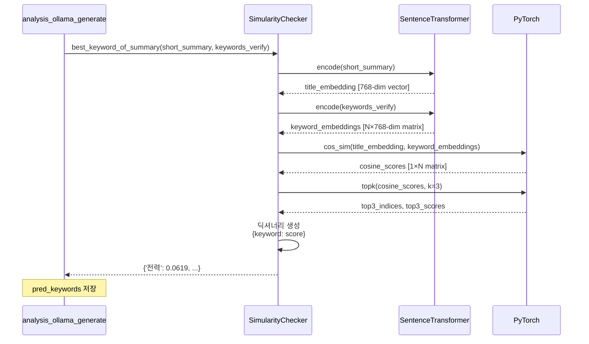

# predKeywords와 ai_keywords 유사도 계산 및 저장 프로세스

## 📋 전체 프로세스 플로우



## 🔍 상세 프로세스 설명

### 1️⃣ **DB에서 predefined 키워드 로드**

**파일**: `analysis_ollama_generate.py` (lines 89-121)

```python
# DB에서 기관별 사전 정의 키워드 로드
keywords_from_db = PredefineKeywordService().get_keywords_by_org_id(queueContent.contentOrgId)
pred_keyword_list = json.dumps(keywords_from_db, ensure_ascii=False)
```

**역할**: 
- 특정 기관(orgId)에 대한 사전 정의된 키워드 리스트를 DB에서 가져옴
- 예: `["전력", "에너지", "안전", "원자력", "배전", ...]`

---

### 2️⃣ **검증 단계 (question_verify)**

**파일**: `analysis_ollama_base.py` (lines 48-82)

**프롬프트 구조**:
```python
question_verify = f"""<|begin_of_text|><|start_header_id|>system<|end_header_id|>
너는 데이터 매칭 전문가다.
[기사]와 [DB 키워드 리스트]를 매칭해라.

출력:
{
    "ai_keyword": ["기사에서 추출한 핵심 주제"],
    "db_keyword_list": ["입력받은 리스트 그대로"],
    "related": true/false,
    "reason": ["DB 키워드 리스트 중 매칭된 단어들"]
}
"""
```

**파일**: `analysis_ollama_generate.py` (lines 121-135)

```python
result_verify = ollama.generate(
    model=CONF.OLLAMA_MODEL,
    prompt=pre_question_verify,
    format="json")

result_verify_json = json.loads(result_verify.response)
ai_keywords = result_verify_json["ai_keyword"]       # LLM이 추출한 기사의 핵심 키워드
keywords_verify = result_verify_json['reason']       # DB 키워드 중 매칭된 것
related = result_verify_json.get("related", False)   # 관련성 여부
```

**출력 예시**:
```json
{
    "ai_keyword": ["한국전력", "급식", "부실"],
    "db_keyword_list": ["전력", "에너지", "안전", ...],
    "related": true,
    "reason": ["전력"]
}
```

---

### 3️⃣ **요약 단계 (question_summary)**

**파일**: `analysis_ollama_generate.py` (lines 138-146)

```python
result_summary = ollama.generate(
    model=CONF.OLLAMA_MODEL,
    prompt=new_question_summary,
    format="json")

result_summary_json = json.loads(result_summary.response)
# result_summary_json["short_summary"] 사용
```

**출력 예시**:
```json
{
    "short_summary": "한국전력이 직원 급식에서 부실 논란에 휩싸였다.",
    "long_summary": "한국전력공사가 ..."
}
```

---

### 4️⃣ **유사도 계산 (SimularityChecker)**

**파일**: `ksubscribe_server/similarity/simularity_check.py`

#### 4-1. 모델 초기화
```python
class SimularityChecker:
    def __init__(self):
        # 다국어 지원 임베딩 모델 로드
        self.model = SentenceTransformer(
            'sentence-transformers/paraphrase-multilingual-MiniLM-L12-v2'
        )
```

#### 4-2. 유사도 계산 메소드
```python
def best_keyword_of_summary(self, title: str, predefineKeyword: List[str]): 
    # 1. 문장(short_summary)을 벡터화
    title_embedding = self.model.encode(title, convert_to_tensor=True)
    
    # 2. 키워드들(reason 리스트)을 벡터화
    keyword_embeddings = self.model.encode(predefineKeyword, convert_to_tensor=True)

    # 3. 코사인 유사도 계산
    cosine_scores = util.cos_sim(title_embedding, keyword_embeddings)

    # 4. 상위 3개 키워드 선택
    top3_indices = torch.topk(cosine_scores[0], k=min(3, len(predefineKeyword))).indices
    
    # 5. 딕셔너리 생성
    dic = {}
    for index in top3_indices:
        keyword = predefineKeyword[index]
        dic[keyword] = cosine_scores[0][index].item()  # 유사도 점수 (0~1)
    
    print(f"유사도 결과: '{dic}'")
    return dic
```

**실제 호출**:
```python
# analysis_ollama_generate.py (lines 152-154)
pred_keywords = SimularityChecker().best_keyword_of_summary(
    result_summary_json["short_summary"],  # "한국전력이 직원 급식에서..."
    keywords_verify                        # ["전력"]
)
# 결과: {'전력': 0.06188983470201492}
```

#### 4-3. 유사도 계산 알고리즘



---

### 5️⃣ **ContentsMeta에 저장**

**파일**: `analysis_ollama_generate.py` (lines 636-651)

```python
def summary_to_ollamaModel_v2(..., pred_kewords: dict, ai_keywords: list, ...):
    # ai_keywords 저장 (LLM이 추출한 기사 핵심 키워드)
    keyword = ai_keywords
    if keyword is not None and isinstance(keyword, list): 
        contentsMetaResult.contentsMeta.keywords = keyword
    
    # pred_keywords 저장 (유사도 점수가 포함된 딕셔너리)
    predkeywords = pred_kewords
    if predkeywords is not None and isinstance(predkeywords, dict):
        contentsMetaResult.contentsMeta.predKeywords = self.nomalize_keywords(predkeywords)
    
    # shortSummary, longSummary도 함께 저장
    contentsMetaResult.contentsMeta.shortSummary = result_summary_json["short_summary"]
    contentsMetaResult.contentsMeta.longSummary = result_summary_json["long_summary"]
```

**데이터 구조**:
```python
class ContentsMeta(BaseModel):
    keywords: list                      # ai_keywords - ["한국전력", "급식", "부실"]
    predKeywords: Dict[str, float]     # {'전력': 0.0619, '에너지': 0.0421}
    shortSummary: str
    longSummary: str
    sentiments: List[SentimentInfo]
    ...
```

---

### 6️⃣ **MongoDB 저장**

**저장 위치**: `mycontents.contents` 컬렉션

**문서 구조**:
```json
{
    "_id": ObjectId("68edc849ae3da00bfe2d0cef"),
    "url": "https://news.kbs.co.kr/...",
    "title": "...",
    "contentsMeta": {
        "keywords": ["한국전력", "급식", "부실"],
        "predKeywords": {
            "전력": 0.06188983470201492
        },
        "shortSummary": "한국전력이 직원 급식에서 부실 논란에 휩싸였다.",
        "longSummary": "...",
        "sentiments": [...]
    }
}
```

---

## 📊 유사도 계산 상세 다이어그램



---

## 🔢 실제 실행 예시

### 입력
```python
short_summary = "한국전력이 직원 급식에서 부실 논란에 휩싸였다."
keywords_verify = ['전력']  # 검증 단계에서 매칭된 DB 키워드
```

### 처리
1. **임베딩**: 
   - short_summary → 768차원 벡터
   - '전력' → 768차원 벡터

2. **코사인 유사도**:
   ```
   cos_sim = dot(v1, v2) / (||v1|| * ||v2||)
   score = 0.06188983470201492
   ```

3. **결과**:
   ```python
   {'전력': 0.06188983470201492}
   ```

### 로그 출력
```
🔍 [Debug] keywords_verify: ['전력']
유사도 결과: '{'전력': 0.06188983470201492}'
🔍 [Debug] pred_keywords: {'전력': 0.06188983470201492}
```

---

## 📁 관련 파일 목록

| 파일 | 역할 |
|------|------|
| `ksubscribe_server/similarity/simularity_check.py` | 유사도 계산 엔진 |
| `ksubscribe_server/analysis/analysis_ollama_base.py` | 프롬프트 정의 |
| `ksubscribe_server/analysis/analysis_ollama_generate.py` | 오케스트레이션 & 저장 로직 |
| `ksubscribe_share/db/dbmodelV2/contentsVO.py` | 데이터 모델 정의 |
| `ksubscribe_server/service/predefineKeywordService.py` | DB 키워드 조회 |

---

## 🎯 핵심 포인트

1. **ai_keyword**: LLM이 기사에서 직접 추출한 핵심 키워드 (자유 형식)
2. **predKeywords**: DB 사전정의 키워드 중 short_summary와 유사도가 높은 것들 (유사도 점수 포함)
3. **유사도 모델**: `paraphrase-multilingual-MiniLM-L12-v2` (다국어 지원)
4. **유사도 범위**: 0.0 ~ 1.0 (1.0에 가까울수록 유사)
5. **상위 K개**: 최대 3개 키워드 선택
6. **저장소**: MongoDB `mycontents.contents` 컬렉션

---

## 💡 개선 가능 영역

1. **유사도 임계값**: 현재는 상위 K개만 선택, 최소 유사도 기준(threshold) 추가 고려
2. **모델 업그레이드**: 더 큰 임베딩 모델 또는 domain-specific 모델 사용
3. **캐싱**: 키워드 임베딩 결과 캐싱으로 성능 향상
4. **배치 처리**: 여러 기사 동시 처리 시 벡터 연산 배치화
