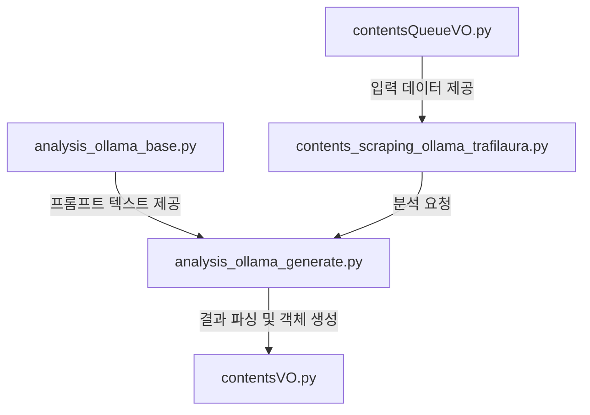

# 프롬프트 변경 시 영향도 분석 및 체크리스트

이 문서는 `AnalysisOllamaBase`의 프롬프트를 수정, 삭제, 생성할 때 연결된 다른 파일들에 미치는 영향과 수정해야 할 위치를 상세히 안내합니다.

---

## 1. 파일 간 의존성 구조 (Dependency Map)

데이터는 아래 화살표 방향으로 흐릅니다. 상위 단계가 변경되면 하위 단계도 검토해야 합니다.



| 파일명 | 역할 | 프롬프트 변경 시 영향도 |
| :--- | :--- | :--- |
| **`analysis_ollama_base.py`** | **[정의]** 프롬프트 템플릿 저장소 | **[시작점]** 여기서 수정이 시작됨 |
| **`analysis_ollama_generate.py`** | **[실행/파싱]** LLM 호출 및 JSON 파싱 | **[매우 높음]** 출력 포맷(JSON 키)이나 입력 변수(`[contents]`)가 바뀌면 무조건 수정 |
| **`contentsVO.py`** | **[저장]** 결과 데이터 구조 (Class) | **[높음]** 새로운 정보를 추출하도록 프롬프트를 고쳤다면 필드 추가 필요 |
| **`contents_scraping_ollama_trafilaura.py`** | **[조율]** 전체 파이프라인 실행 | **[중간]** `generate` 함수의 파라미터나 리턴값이 바뀔 때만 수정 |
| **`contentsQueueVO.py`** | **[입력]** 분석 대상 원본 데이터 | **[낮음]** 프롬프트에 새로운 입력값(예: `pubDt`)을 넣고 싶을 때만 참조 |

---

## 2. 시나리오별 수정 체크리스트

### 상황 A: 단순 문구/지시사항 수정 (가장 흔함)
> 예: "요약해줘"를 "3줄로 요약해줘"로 변경. JSON 키(`key`)는 그대로 유지.

1.  **`analysis_ollama_base.py`**
    *   [ ] 해당 변수(예: `question_summary`)의 텍스트 수정.
2.  **나머지 파일들**
    *   [ ] **수정 불필요**. (입출력 규격이 같으므로 로직 변경 없음)

### 상황 B: 출력 데이터 구조 변경 (JSON Key 추가/변경)
> 예: 감성 분석 결과에 `neutralKeywords` (중립 키워드)를 추가하고 싶음.

1.  **`analysis_ollama_base.py`**
    *   [ ] 프롬프트 내 JSON 예시에 `"neutralKeywords": [...]` 추가.
2.  **`contentsVO.py`**
    *   [ ] `SentimentInfo` 클래스 `__init__`에 `neutralKeywords` 파라미터 추가.
    *   [ ] `self.neutralKeywords` 멤버 변수 할당 로직 추가.
3.  **`analysis_ollama_generate.py`**
    *   [ ] `json_load` 또는 `assemble_...` 메서드에서 `result_json.get("neutralKeywords")` 로직 추가.
    *   [ ] `SentimentInfo()` 객체 생성 시 해당 값 전달.

### 상황 C: 입력 변수 추가 (Input Variable)
> 예: 프롬프트에 기사 본문(`[contents]`) 외에 발행일(`[pubDt]`) 정보도 넣고 싶음.

1.  **`analysis_ollama_base.py`**
    *   [ ] 프롬프트 텍스트에 `[pubDt]` 플레이스홀더 추가.
2.  **`analysis_ollama_generate.py`**
    *   [ ] `analysis_main` 등의 메서드 파라미터에 `pubDt`가 있는지 확인.
    *   [ ] `prompt.replace("[pubDt]", pubDt)` 코드 추가.
3.  **`contents_scraping_ollama_trafilaura.py`**
    *   [ ] `ollamaAnalysis.analysis_main(...)` 호출부에서 `queueContent.pubDt`를 인자로 넘겨주도록 수정.
4.  **`contentsQueueVO.py`**
    *   [ ] 만약 `pubDt`가 `ContentsQueueVO`에 없다면 필드 추가 (보통은 이미 있음).

---

## 3. 파일별 상세 분석 및 주의사항

### 3.1 `analysis_ollama_base.py`
*   **주의사항**: f-string 내부의 중괄호 `{ }`는 파이썬 변수 치환용입니다. JSON 포맷을 표현하려면 중괄호를 두 번 써야 합니다 (`{{ "key": "value" }}`).
*   **팁**: 프롬프트 변수명은 용도를 명확히 하세요 (예: `question_summary_v2`).

### 3.2 `analysis_ollama_generate.py`
이 파일은 **프롬프트와 코드의 접착제**입니다. 가장 에러가 많이 나는 곳입니다.
*   **`replace` 메서드**: `base.py`에서 정의한 `[placeholder]`와 정확히 일치해야 합니다. 오타 주의.
*   **`json_load` 메서드**: LLM이 가끔 JSON 형식을 깨뜨릴 수 있습니다. 파싱 실패 시 예외 처리가 되어 있는지 확인하세요.
*   **`assemble_...` 메서드**: 파싱된 딕셔너리 값을 `contentsVO` 객체로 옮겨 담는 곳입니다. 여기서 누락되면 DB에 저장되지 않습니다.

### 3.3 `contentsVO.py`
*   **`SentimentInfo` 클래스**: 감성 분석 결과가 늘어나면 여기를 수정해야 합니다.
*   **`ContentsMeta` 클래스**: 요약이나 전체 분석 메타데이터가 늘어나면 여기를 수정해야 합니다.
*   **`to_mongo` / `from_mongo`**: MongoDB 저장/조회 시 필드 누락이 없는지 확인해야 합니다. (자동 매핑이 아니라 수동 매핑인 경우 특히 주의)

### 3.4 `contents_scraping_ollama_trafilaura.py`
*   **역할**: `ContentsQueueVO`에서 데이터를 꺼내 `generate.py`에게 넘겨줍니다.
*   **주의사항**: `generate.py`의 함수 시그니처(인자 개수, 순서)를 바꾸면, 이 파일의 호출부(`crawl_and_analyze_one_ollama`)도 반드시 수정해야 합니다.

---

## 4. 테스트 및 검증 (`test_llm_evaluation.py` 활용)

수정 후에는 반드시 `test_llm_evaluation.py`를 사용하여 검증해야 합니다.

1.  **프롬프트 오버라이드 테스트**: 코드를 고치기 전, `--prompt-overrides` 옵션으로 프롬프트만 바꿔서 테스트해 봅니다.
    ```bash
    python3 test_llm_evaluation.py --test-ids ... --prompt-overrides my_new_prompt.json
    ```
2.  **코드 수정 후 테스트**: 실제 코드를 수정한 후 실행하여 에러 로그(`json parsing error` 등)가 없는지 확인합니다.
3.  **결과 확인**: `--save-json` 옵션으로 결과를 저장하고, 새로 추가한 필드(예: `neutralKeywords`)가 JSON에 포함되어 있는지 확인합니다.
