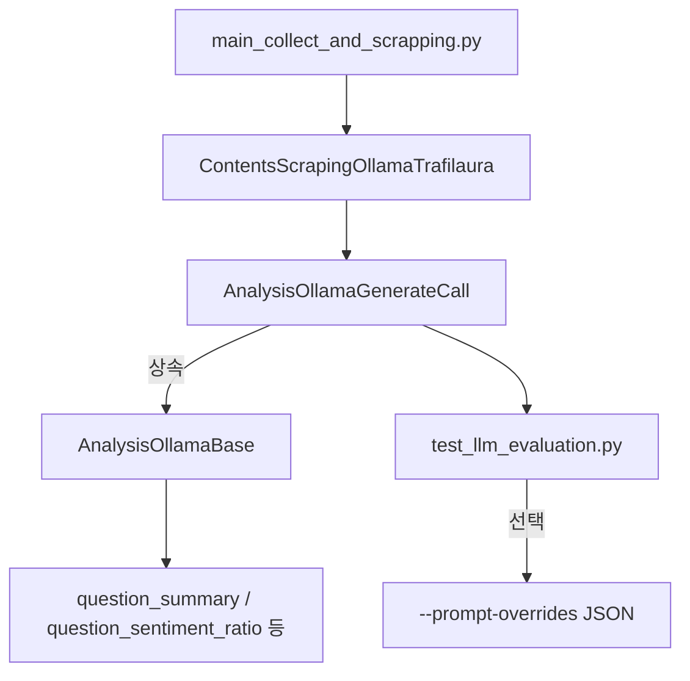

# Ollama 프롬프트 흐름 정리

## 1. 전체 흐름 개요
- 본 파이프라인은 `docker_shell/main_collect_and_scrapping.py`에서 시작해 기사 수집 → 스크래핑 → LLM 분석까지 차례로 호출합니다.
- 실제 프롬프트 문자열은 `ksubscribe_server/analysis/analysis_ollama_base.py` 내부 속성(`question_summary`, `question_sentiment_ratio`, …)에 정의되어 있습니다.
- `AnalysisOllamaGenerateCall`이 이 Base 클래스를 상속받아 프롬프트를 사용하며, 스크래핑 파이프라인과 테스트 스크립트 둘 다 동일한 클래스를 재사용합니다.
- `analysis_ollama.py`는 과거 버전에서 쓰이던 별도 분석기이며 현재 메인 파이프라인에서는 호출되지 않습니다.

## 2. 흐름도

## 3. 단계별 설명
1. **메인 파이프라인 진입** (`docker_shell/main_collect_and_scrapping.py`)
   - Queue dedup, Ollama 상태 확인 후 `ContentsScrapingOllamaTrafilaura.crawl_and_analyze_ollama()` 호출
2. **스크래핑 단계** (`docker_scraping/contents_scraping_ollama_trafilaura.py`)
   - 기사 본문·메타 정보 수집
   - LLM 분석이 필요할 때 `AnalysisOllamaGenerateCall` 인스턴스를 생성
3. **LLM 분석 클래스** (`ksubscribe_server/analysis/analysis_ollama_generate.py`)
   - `AnalysisOllamaBase`를 상속받아 프롬프트 속성과 헬퍼 로직을 그대로 사용
   - summarize, sentiment, ratio 등 모든 Prompt 문자열은 Base 쪽 정의가 그대로 주입됨
4. **프롬프트 정의 베이스** (`ksubscribe_server/analysis/analysis_ollama_base.py`)
   - `question_summary`, `question_sentiment`, `question_sentiment_ratio`, `sentiment_reason`, `sentiment_keywords`, `question_verify` 등 전체 문자열을 보관
5. **테스트 스크립트** (`ksubscribe_share/test/test_llm_evaluation.py`)
   - 본 파이프라인과 같은 `AnalysisOllamaGenerateCall`을 사용
   - `--prompt-overrides some.json` 옵션을 주면 JSON의 키명이 Base 속성과 일치하는 경우에만 런타임에서 덮어씀

## 4. 자주 묻는 질문
- **Q. main_collect_and_scrapping.py 실행 시 어떤 프롬프트가 쓰이나요?**
  - `analysis_ollama_base.py`의 프롬프트만 사용됩니다. `analysis_ollama.py`는 호출되지 않습니다.
- **Q. test_llm_evaluation.py가 기본 모드로 실행되면?**
  - 동일하게 Base 프롬프트를 사용하며, JSON 오버라이드가 있을 때만 런타임 교체가 일어납니다.
- **Q. 분석 파이프라인에서 두 파일을 모두 쓰는 경우가 있나요?**
  - 없습니다. 현행 경로에서는 오직 `AnalysisOllamaGenerateCall → AnalysisOllamaBase` 체인만 사용됩니다.

## 5. 프롬프트 별 역할과 영향 범위
| 프롬프트 속성 | 주요 용도 | 전체 업무 영향도 |
| --- | --- | --- |
| `question` / `question_new` / `answer_template` | 원문 HTML 1건에서 키워드·요약·감성 전체를 추출하는 메인 지시문. JSON 스키마, 필드 수, 길이 제한 등을 정의. | **매우 큼**. 요약, predkeywords, sentiments 전부에 영향을 주므로 DB 스키마나 후속 검증 로직도 함께 테스트해야 함. |
| `question_summary` | 기관 관점의 short/long summary 생성. Organization 필드에 맞춰 요약을 조정. | **중간**. 보고서/알림 문구 톤에만 영향을 주며 나머지 메타 필드는 그대로. |
| `question_sentiment` | `sentiments` 배열 전체를 산출. 기관 리스트 매칭, positive/neutral/negative 비율, reason/keywords 모두 이 프롬프트에 의존. | **매우 큼**. 감성 UI, 통계 지표, 경보 로직까지 직결되므로 변경 시 전반 리그레션 체크 필요. |
| `question_sentiment_ratio` | 단일 기관 기준의 비율(positive/neutral/negative)만 산출. synonyms 처리와 값 범위를 제어. | **크다**. downstream reason/keyword/보고 데이터의 근간이 되므로 감성 수치에 직접 영향. |
| `sentiment_reason` | 이미 계산된 감성 비율을 설명 문장으로 변환. | **중간**. 설명/리포트 품질에만 영향. 수치나 DB 구조는 동일. |
| `sentiment_keywords` | 기관 평판에 영향을 주는 긍·부정 키워드를 추출. 문맥성 있는 표현 요구 조건을 정의. | **중간**. 보고용 키워드, 알림 메시지 품질에 영향. |
| `question_verify` | LLM이 뽑은 키워드와 DB 키워드 리스트를 비교해 관련성 여부를 판정. | **작음**. 모니터링/검증 용도로만 쓰이며 메인 저장 로직에는 간접 영향.

> ✅ JSON 오버라이드(`--prompt-overrides`)는 위 속성 이름과 동일한 키만 덮어쓰니, 특정 업무만 조정하고 싶으면 해당 속성만 포함한 JSON을 만들어 실험하면 된다.

## 6. 한국어 응답 강제 전략 (GPT-OSS, Llama 모델 공통)
두 모델 모두 기본적으로 다국어 출력을 지원하므로, 프롬프트 안에서 “반드시 한국어로만 작성”이라는 지시를 명시해야 확실합니다. 적용 방법은 다음과 같습니다.

1. **핵심 JSON 프롬프트 (`question`, `question_new`)**
   - 상단 또는 JSON 직전 설명에 `반드시 한국어로 작성하고 JSON만 출력해` 같은 문구를 추가.
   - 예: `"contents" = [contents]\n반드시 한국어로만 답하고 ...`.
2. **요약 프롬프트 (`question_summary`)**
   - 기관 관점 요약이 영어로 나오는 경우가 많으므로, `한국어` 지시를 short/long summary 설명에 병기.
3. **감성 프롬프트 (`question_sentiment`, `question_sentiment_ratio`, `sentiment_reason`, `sentiment_keywords`)**
   - 비율 설명, reason, keywords 모두 한국어로 작성하도록 각 JSON 설명에 `한국어 키`, `한국어 문장` 요구를 명시.
4. **오버라이드 활용**
   - 운영 중 한시적으로 지시를 바꿀 땐 `test/prompts/alt_summary_sample.json`처럼 JSON을 만들어 `question`, `question_summary` 등에 한국어 지시를 덮어쓰면 테스트 없이도 즉시 효과 확인 가능.

프롬프트를 한 곳만 고치면 다른 파이프라인에도 그대로 반영되므로, 메인 Base 파일의 해당 문자열을 수정하고 곧바로 스크립트/파이프라인을 실행해 한국어 출력 여부를 검증하면 된다.

---
*문서 작성일: 2025-11-27*
