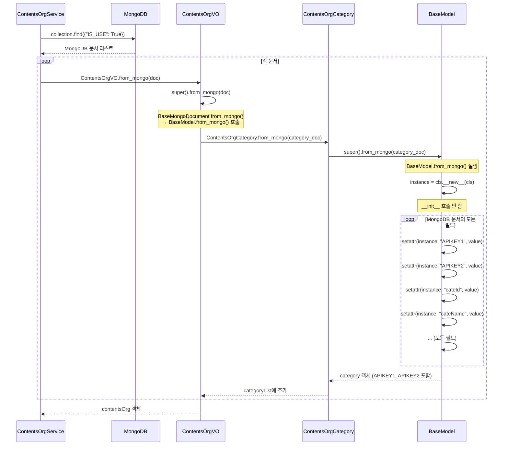

# ContentsOrgCategory API Key 로드 메커니즘 분석

> 작성일: 2025-12-23  
> 분석 대상: `BaseModel.from_mongo()`의 동적 필드 할당 메커니즘

---

## 📋 목차

1. [문제 제기](#1-문제-제기)
2. [핵심 메커니즘: BaseModel.from_mongo()](#2-핵심-메커니즘-basemodelfrom_mongo)
3. [동작 원리 상세 분석](#3-동작-원리-상세-분석)
4. [실제 데이터 흐름](#4-실제-데이터-흐름)
5. [요약](#5-요약)

---

## 1. 문제 제기

### 1.1 질문

**Q**: `ContentsOrgCategory` 클래스에서 `APIKEY1`, `APIKEY2`는 어떻게 가져오는가?  
**A**: `BaseModel`에는 정의되어 있지 않은데 어떻게 접근 가능한가?

### 1.2 코드 구조

```python
# contentsOrgVO.py
class ContentsOrgCategory(BaseModel):  # BaseModel 상속
    def __init__(
        self,
        ...
        APIKEY1 : str = None,  # __init__에서 파라미터로 정의
        APIKEY2 : str = None,  # __init__에서 파라미터로 정의
        ...
    ):
        self.APIKEY1 = APIKEY1  # 인스턴스 변수로 할당
        self.APIKEY2 = APIKEY2  # 인스턴스 변수로 할당
```

**문제**: `BaseModel`에는 `APIKEY1`, `APIKEY2`가 정의되어 있지 않음

---

## 2. 핵심 메커니즘: BaseModel.from_mongo()

### 2.1 BaseModel.from_mongo() 메서드

**파일**: `src/ksubscribe_share/db/dbmodelV2/baseDocument.py` (Line 19-26)

```python
@classmethod
def from_mongo(cls: Type[T], document: dict) -> T:
    """MongoDB 문서를 클래스로 변환"""
    instance = cls.__new__(cls)  # __init__ 호출 없이 객체 생성
    for key, value in document.items():
        #if hasattr(instance, key):  # 클래스에 정의된 속성만 설정 (주석처리됨)
        setattr(instance, key, value)  # 동적으로 속성 할당
    return instance
```

### 2.2 핵심 포인트

1. **`cls.__new__(cls)`**: `__init__`을 호출하지 않고 객체만 생성
   - 일반적인 객체 생성: `ContentsOrgCategory()` → `__init__()` 호출
   - `from_mongo()` 사용: `ContentsOrgCategory.__new__(ContentsOrgCategory)` → `__init__()` 호출 안 함

2. **`setattr(instance, key, value)`**: MongoDB 문서의 모든 필드를 객체 속성으로 동적 할당
   - MongoDB 문서에 `APIKEY1`, `APIKEY2` 필드가 있으면 자동으로 객체 속성으로 할당됨
   - `__init__`에서 정의하지 않은 필드도 할당 가능

3. **주석처리된 체크**: `#if hasattr(instance, key):`
   - 원래는 클래스에 정의된 속성만 설정하려고 했던 것 같지만, 주석처리되어 있음
   - 따라서 MongoDB 문서의 모든 필드가 객체 속성으로 할당됨

---

## 3. 동작 원리 상세 분석

### 3.1 일반적인 객체 생성 vs from_mongo()

#### A. 일반적인 객체 생성 (__init__ 사용)

```python
# 일반적인 방법
category = ContentsOrgCategory(
    cateId="B0005",
    APIKEY1="some_key",
    APIKEY2="some_secret"
)
# → __init__() 호출됨
# → self.APIKEY1 = APIKEY1 실행됨
```

#### B. from_mongo() 사용 (동적 할당)

```python
# MongoDB 문서
mongo_doc = {
    "cateId": "B0005",
    "cateName": "입찰공고",
    "APIKEY1": "efdW9bR%2FAKR6XOI%2F...",
    "APIKEY2": None,
    "COL_METHOD": "C0002",
    # ... 기타 필드들
}

# from_mongo() 호출
category = ContentsOrgCategory.from_mongo(mongo_doc)

# 내부 동작:
# 1. instance = ContentsOrgCategory.__new__(ContentsOrgCategory)  # __init__ 호출 안 함
# 2. for key, value in mongo_doc.items():
#        setattr(instance, key, value)
#    → setattr(instance, "APIKEY1", "efdW9bR%2FAKR6XOI%2F...")
#    → setattr(instance, "APIKEY2", None)
#    → setattr(instance, "COL_METHOD", "C0002")
#    → ... (모든 필드 할당)
```

### 3.2 왜 __init__을 호출하지 않는가?

**이유**: MongoDB 문서에는 `__init__`에서 정의하지 않은 필드도 포함될 수 있기 때문

**예시**:
- `__init__`에서 정의: `APIKEY1`, `APIKEY2`, `cateId`, `cateName` 등
- MongoDB 문서에 실제로 있는 필드: 위 필드들 + `REG_ID`, `REG_DT`, `EDIT_ID`, `EDIT_DT` 등

만약 `__init__`을 호출하면:
- `__init__`에 정의되지 않은 필드(`REG_ID`, `REG_DT` 등)는 할당되지 않음
- MongoDB 문서의 일부 데이터가 손실됨

**해결책**: `__init__`을 호출하지 않고, MongoDB 문서의 모든 필드를 `setattr`로 직접 할당

---

## 4. 실제 데이터 흐름

### 4.1 MongoDB 쿼리 위치 및 컬렉션 정보

#### A. MongoDB 컬렉션

**컬렉션 이름**: `contents_org`  
**정의 위치**: `ContentsOrgVO.collectionName = "contents_org"` (Line 92)

#### B. 쿼리 실행 위치

**서비스 클래스**: `ContentsOrgService`  
**파일**: `src/ksubscribe_share/db/service/contentsOrgService.py`

**주요 메서드들**:

1. **`find_all()`** (Line 71-94)
   ```python
   collection = self.mongoManager.getCollection(self.collectionName)  # "contents_org"
   cursor = collection.find({"IS_USE": True})
   result_list = [ContentsOrgVO.from_mongo(item) for item in cursor]
   ```

2. **`findOrgAndCategory(orgId, cateId)`** (Line 145-167)
   ```python
   collection = self.mongoManager.getCollection(self.collectionName)  # "contents_org"
   query = {"orgId": orgId}
   result = collection.find_one(query)
   contentsOrgVO = ContentsOrgVO.from_mongo(result)
   ```

3. **`findOrg(orgId)`** (Line 185-202)
   ```python
   collection = self.mongoManager.getCollection(self.collectionName)  # "contents_org"
   query = {"orgId": orgId}
   result = collection.find_one(query)
   contentsOrgVO = ContentsOrgVO.from_mongo(result)
   ```

#### C. MongoDB 문서 구조

```json
{
  "_id": ObjectId("..."),
  "orgId": "A0004",
  "orgName": "나라장터",
  "categoryList": [
    {
      "cateId": "B0005",
      "cateName": "입찰공고",
      "APIKEY1": "efdW9bR%2FAKR6XOI%2F...",
      "APIKEY2": null,
      "COL_METHOD": "C0002",
      "lastSucYMD": ISODate("2025-12-23T00:00:00Z"),
      // ... 기타 필드들
    }
  ],
  // ... 기타 필드들
}
```

**핵심 포인트**:
- `APIKEY1`, `APIKEY2`는 `categoryList` 배열 내부의 각 카테고리 객체에 저장됨
- MongoDB 쿼리는 `contents_org` 컬렉션에서 전체 문서를 가져옴 (필드 선택 없음)
- 따라서 `categoryList` 내부의 모든 필드(`APIKEY1`, `APIKEY2` 포함)가 함께 조회됨

### 4.2 전체 흐름도



### 4.3 실제 코드 실행 예시

#### Step 1: MongoDB에서 조회

**파일**: `src/ksubscribe_share/db/service/contentsOrgService.py`  
**메서드**: `find_all()` (Line 71-94)

```python
# ContentsOrgService.find_all()
collection = self.mongoManager.getCollection(self.collectionName)  # "contents_org"
cursor = collection.find({"IS_USE": True})  # 전체 문서 조회 (필드 선택 없음)

# MongoDB 문서 예시 (실제 조회된 문서)
mongo_doc = {
    "_id": ObjectId("6784a2c51ccfd362485cdfcd"),
    "orgId": "A0004",
    "orgName": "나라장터",
    "categoryList": [
        {
            "cateId": "B0005",
            "cateName": "입찰공고",
            "APIKEY1": "efdW9bR%2FAKR6XOI%2F...",  # ✅ MongoDB에 저장된 값
            "APIKEY2": None,  # ✅ MongoDB에 저장된 값
            "COL_METHOD": "C0002",
            "lastSucYMD": ISODate("2025-12-23T00:00:00Z"),
            # ... 기타 필드들
        }
    ]
}
```

**중요**: MongoDB 쿼리는 **필드 선택 없이 전체 문서**를 가져옴
- `collection.find()` 또는 `collection.find_one()` 사용
- `projection` 파라미터 없음 → 모든 필드 조회
- 따라서 `categoryList[].APIKEY1`, `categoryList[].APIKEY2`도 함께 조회됨

#### Step 2: ContentsOrgVO.from_mongo() 호출

**파일**: `src/ksubscribe_share/db/dbmodelV2/contentsOrgVO.py`  
**메서드**: `ContentsOrgVO.from_mongo()` (Line 148-162)

```python
# contentsOrgVO.py Line 148-162
@classmethod
def from_mongo(cls: Type[T], mongo_data: Dict) -> T:
    """
    MongoDB 문서 데이터를 Python 객체로 변환
    """
    # 상위 클래스의 from_mongo 호출
    instance = super().from_mongo(mongo_data)  # BaseMongoDocument.from_mongo()
    
    # categoryList 변환
    instance.categoryList = [
        ContentsOrgCategory.from_mongo(category)  # 각 카테고리 변환
        for category in mongo_data.get("categoryList", [])
    ]
    return instance
```

**호출 위치**: `ContentsOrgService`의 여러 메서드에서 호출
- `find_all()`: Line 75 → `ContentsOrgVO.from_mongo(item)`
- `findOrgAndCategory()`: Line 156 → `ContentsOrgVO.from_mongo(result)`
- `findOrg()`: Line 196 → `ContentsOrgVO.from_mongo(result)`

#### Step 3: ContentsOrgCategory.from_mongo() 호출

**파일**: `src/ksubscribe_share/db/dbmodelV2/contentsOrgVO.py`  
**메서드**: `ContentsOrgCategory.from_mongo()` (상속받음)

**호출 위치**: `ContentsOrgVO.from_mongo()` Line 158

```python
# ContentsOrgCategory는 BaseModel을 상속받으므로
# BaseModel.from_mongo()를 상속받음

# ContentsOrgVO.from_mongo()에서 호출되는 부분
for category in mongo_data.get("categoryList", []):
    # category는 MongoDB 문서의 categoryList 배열 내부의 각 객체
    category_doc = {
        "cateId": "B0005",
        "cateName": "입찰공고",
        "APIKEY1": "efdW9bR%2FAKR6XOI%2F...",  # ✅ MongoDB에서 가져온 값
        "APIKEY2": None,  # ✅ MongoDB에서 가져온 값
        "COL_METHOD": "C0002",
        "lastSucYMD": ISODate("2025-12-23T00:00:00Z"),
        # ... 기타 필드들
    }
    
    # ContentsOrgCategory.from_mongo(category_doc) 호출
    # → BaseModel.from_mongo(category_doc) 실행
```

**BaseModel.from_mongo() 내부 동작** (Line 19-26):

```python
# baseDocument.py Line 19-26
@classmethod
def from_mongo(cls: Type[T], document: dict) -> T:
    instance = cls.__new__(cls)  # __init__ 호출 안 함
    for key, value in document.items():
        setattr(instance, key, value)
        # → setattr(instance, "APIKEY1", "efdW9bR%2FAKR6XOI%2F...")
        # → setattr(instance, "APIKEY2", None)
        # → setattr(instance, "cateId", "B0005")
        # → setattr(instance, "cateName", "입찰공고")
        # → ... (MongoDB 문서의 모든 필드)
    return instance  # APIKEY1, APIKEY2가 할당된 객체 반환
```

#### Step 4: 최종 사용

**파일**: `src/docker_collect/openapi_collector.py`

**예시 1: 나라장터 API Key 사용** (Line 109-110)

```python
# collect_v2.py에서 호출
result = get_g2b_nara(contentsOrg, category, g2b_keywords)

# openapi_collector.py 내부
def get_g2b_nara(contentsOrg, category, g2b_keywords):
    service_key = category.APIKEY1  # ✅ MongoDB에서 가져온 값 사용
    # API URL 구성 및 호출
```

**예시 2: 네이버 뉴스 API Key 사용** (Line 114)

```python
# collect_v2.py에서 호출
result = get_naver_news("A0026", contentsOrg, category)

# openapi_collector.py 내부
def get_naver_news(orgId, contentsOrg, category):
    client_id = category.APIKEY1     # ✅ MongoDB에서 가져온 값 사용
    client_secret = category.APIKEY2  # ✅ MongoDB에서 가져온 값 사용
    # API 헤더 구성 및 호출
```

**전체 호출 체인**:

```
MongoDB (contents_org 컬렉션)
    ↓
ContentsOrgService.find_all() / findOrgAndCategory() / findOrg()
    ↓
collection.find() / collection.find_one()  # 전체 문서 조회 (필드 선택 없음)
    ↓
ContentsOrgVO.from_mongo(result)
    ↓
ContentsOrgCategory.from_mongo(category)  # categoryList의 각 항목
    ↓
BaseModel.from_mongo(category_doc)  # APIKEY1, APIKEY2 동적 할당
    ↓
category.APIKEY1, category.APIKEY2 접근 가능 ✅
```

---

## 5. 요약

### 5.1 핵심 메커니즘

| 항목 | 설명 |
|------|------|
| **메서드** | `BaseModel.from_mongo()` |
| **위치** | `baseDocument.py` Line 19-26 |
| **동작** | `__init__` 호출 없이 객체 생성 후, MongoDB 문서의 모든 필드를 `setattr`로 동적 할당 |
| **결과** | `__init__`에 정의되지 않은 필드도 객체 속성으로 할당됨 |

### 5.2 APIKEY1, APIKEY2 할당 과정

```
MongoDB 문서
    ↓
BaseModel.from_mongo(category_doc)
    ↓
instance = cls.__new__(cls)  # __init__ 호출 안 함
    ↓
for key, value in category_doc.items():
    setattr(instance, key, value)
    → setattr(instance, "APIKEY1", "efdW9bR%2F...")
    → setattr(instance, "APIKEY2", None)
    ↓
category.APIKEY1, category.APIKEY2 접근 가능
```

### 5.3 왜 BaseModel에 정의가 없어도 되는가?

**답**: `BaseModel.from_mongo()`가 **동적 할당(Dynamic Assignment)**을 사용하기 때문

- `__init__`에서 정의: 일반적인 객체 생성 시 사용 (타입 힌팅, 기본값 설정)
- `from_mongo()`에서 할당: MongoDB 문서의 모든 필드를 `setattr`로 동적 할당

**장점**:
- MongoDB 스키마 변경 시 Python 코드 수정 불필요
- `__init__`에 정의하지 않은 필드도 자동으로 할당됨

**단점**:
- 타입 안정성 부족 (런타임에만 필드 존재 확인 가능)
- IDE 자동완성 지원 제한적

### 5.4 MongoDB 쿼리에서 APIKEY1, APIKEY2를 가져오는 방법

**핵심**: MongoDB 쿼리는 **필드 선택 없이 전체 문서**를 조회함

**위치**: `ContentsOrgService`의 모든 메서드

```python
# ❌ 필드 선택 없음 (projection 없음)
collection.find({"IS_USE": True})  # 전체 문서 조회
collection.find_one({"orgId": orgId})  # 전체 문서 조회

# ✅ 따라서 categoryList 내부의 모든 필드가 함께 조회됨
# → categoryList[].APIKEY1
# → categoryList[].APIKEY2
# → categoryList[].cateId
# → categoryList[].cateName
# → ... (모든 필드)
```

**결론**: 
- MongoDB 쿼리에서 명시적으로 `APIKEY1`, `APIKEY2`를 지정할 필요 없음
- `categoryList` 배열을 조회하면 내부의 모든 필드가 자동으로 포함됨
- `BaseModel.from_mongo()`가 MongoDB 문서의 모든 필드를 동적으로 할당하므로, `APIKEY1`, `APIKEY2`도 자동으로 객체 속성으로 할당됨

### 5.5 __init__의 역할

`ContentsOrgCategory.__init__()`에서 `APIKEY1`, `APIKEY2`를 정의하는 이유:

1. **타입 힌팅**: IDE와 타입 체커를 위한 정보 제공
2. **일반 객체 생성 시 사용**: `ContentsOrgCategory(APIKEY1="...")` 형태로 생성할 때
3. **문서화**: 클래스가 어떤 필드를 가질 수 있는지 명시

하지만 `from_mongo()`를 사용할 때는 `__init__`이 호출되지 않으므로, `__init__`에 정의되지 않은 필드도 할당 가능합니다.

---

## 6. 검증 코드

다음 코드로 동작을 확인할 수 있습니다:

```python
from ksubscribe_share.db.dbmodelV2.contentsOrgVO import ContentsOrgCategory

# MongoDB 문서 (예시)
mongo_doc = {
    "cateId": "B0005",
    "cateName": "입찰공고",
    "APIKEY1": "test_key_123",
    "APIKEY2": "test_secret_456",
    "COL_METHOD": "C0002"
}

# from_mongo() 사용
category = ContentsOrgCategory.from_mongo(mongo_doc)

# APIKEY1, APIKEY2 접근 가능
print(category.APIKEY1)  # "test_key_123"
print(category.APIKEY2)  # "test_secret_456"

# __init__에 정의되지 않은 필드도 할당됨
print(category.COL_METHOD)  # "C0002"
```

---

## 7. 결론

**Q**: `ContentsOrgCategory`에서 `APIKEY1`, `APIKEY2`는 어떻게 가져오는가?  
**A**: `BaseModel.from_mongo()` 메서드가 MongoDB 문서의 모든 필드를 `setattr()`로 동적으로 객체 속성으로 할당하기 때문입니다.

**핵심 포인트**:

1. **MongoDB 쿼리 위치**:
   - 컬렉션: `contents_org`
   - 서비스: `ContentsOrgService.find_all()`, `findOrgAndCategory()`, `findOrg()` 등
   - 쿼리: 필드 선택 없이 전체 문서 조회 → `categoryList` 배열 내부의 모든 필드 포함

2. **호출 체인**:
   ```
   ContentsOrgService.find_all()
       → collection.find({"IS_USE": True})
       → ContentsOrgVO.from_mongo(result)
       → ContentsOrgCategory.from_mongo(category)
       → BaseModel.from_mongo(category_doc)
       → setattr(instance, "APIKEY1", value)
       → setattr(instance, "APIKEY2", value)
   ```

3. **동적 할당 메커니즘**:
   - `BaseModel.from_mongo()`는 `__init__`을 호출하지 않음
   - MongoDB 문서의 모든 필드를 `setattr(instance, key, value)`로 할당
   - 따라서 `__init__`에 정의되지 않은 필드(`APIKEY1`, `APIKEY2` 등)도 자동으로 할당됨
   - `BaseModel`에 명시적으로 정의할 필요 없음

4. **최종 사용**:
   - `category.APIKEY1`, `category.APIKEY2`로 접근 가능
   - `openapi_collector.py`에서 실제 API 호출 시 사용됨

