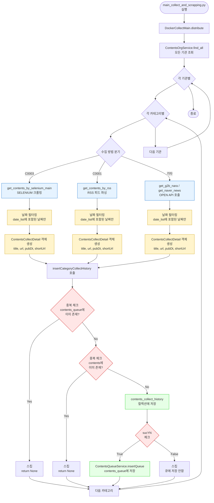

# contents_queue 저장 과정 상세 분석

> 작성일: 2025-12-23  
> 분석 대상: `contents_queue` 컬렉션에 데이터가 저장되는 전체 과정

---

## 📋 목차

1. [사용자 이해 확인](#1-사용자-이해-확인)
2. [전체 흐름도](#2-전체-흐름도)
3. [단계별 상세 분석](#3-단계별-상세-분석)
4. [저장되는 데이터 구조](#4-저장되는-데이터-구조)
5. [중복 체크 메커니즘](#5-중복-체크-메커니즘)
6. [결론](#6-결론)

---

## 1. 사용자 이해 확인

### 1.1 사용자의 현재 이해

✅ **맞는 부분**:
- `main_collect_and_scrapping.py` 실행
- `DockerCollectMain().distribute()` 실행 (Line 49-53)
- 지정된 날짜의 기사를 크롤링
- **기사 원문은 저장하지 않음**
- **URL 정보만 `contents_queue`에 저장**

### 1.2 용어 정리

**크롤링 (Crawling)**:
- 웹사이트에서 기사 목록을 가져오는 과정
- 제목, URL, 발행일 등 메타데이터만 추출
- **본문은 추출하지 않음**

**스크래핑 (Scraping)**:
- 기사 본문을 추출하는 과정
- 이 단계에서는 수행하지 않음
- 나중에 `ContentsScrapingOllamaTrafilaura`에서 수행

---

## 2. 전체 흐름도



---

## 3. 단계별 상세 분석

### 3.1 Step 1: main_collect_and_scrapping.py 실행

**파일**: `main_collect_and_scrapping.py` (Line 49-53)

```python
try:
    # 1. docker collect
    dockerCollectMain = DockerCollectMain()
    logger.info("dockerCollectMain.distribute()")
    dockerCollectMain.distribute()
except Exception as e:
    pass
```

**역할**: 수집 프로세스 시작

---

### 3.2 Step 2: DockerCollectMain.distribute()

**파일**: `collect_v2.py` (Line 61-145)

**처리 과정**:
1. 모든 기관 조회: `ContentsOrgService().find_all()`
2. 각 기관별로 카테고리 순회
3. 수집 방법에 따라 분기:
   - `C0003` (SELENIUM): `get_contents_by_selenium_main()`
   - `C0001` (RSS): `get_contents_by_rss()`
   - 기타 (OPEN API): `get_g2b_nara()` 또는 `get_naver_news()`

---

### 3.3 Step 3: 날짜 필터링 및 기사 목록 추출

#### A. SELENIUM 수집 (`get_contents_by_selenium_main`)

**파일**: `selenium_collector.py`

**날짜 필터링**:
```python
# Line 40-45
last_suc = category.lastSucYMD  # 마지막 성공 수집 날짜
next_day = last_suc
today = datetime.now(pytz.timezone('Asia/Seoul'))
date_list = [(next_day + timedelta(days=x)).strftime("%Y%m%d") 
             for x in range((today - next_day).days + 1)]
```

**기사 추출**:
```python
# Line 264-278 (get_contents_by_selenium 함수 내부)
if date in date_list:  # date_list에 포함된 날짜만
    collectDetail = ContentsCollectDetail()
    collectDetail.url = url           # 기사 URL
    collectDetail.title = title       # 기사 제목
    collectDetail.pubDt = date        # 발행일 (YYYYMMDD 형식)
    collectDetail.shortUrl = unique_value  # 랜덤 문자열 (5자)
    collectDetail.sucYN = bool(title and title.strip() and url and url.strip())
    
    if collectDetail.sucYN:
        # contents_queue에 저장하는 함수 호출
        contentsCollectHistoryService.insertCategoryCollectHistory(
            today, contentsOrg, category, collectDetail, session, logger
        )
```

**중요**: 
- ✅ 제목, URL, 발행일만 추출
- ❌ **기사 본문은 추출하지 않음**

#### B. RSS 수집 (`get_contents_by_rss`)

**파일**: `rss_collector.py`

**날짜 필터링**:
```python
# Line 24-31
last_suc = category.lastSucYMD
next_day = last_suc
today = datetime.now(pytz.timezone('Asia/Seoul'))
date_list = [(next_day + timedelta(days=x)).strftime("%Y%m%d") 
             for x in range((today - next_day).days + 1)]
```

**기사 추출**:
```python
# Line 68-85
if colDt in date_list:  # RSS 피드의 published 날짜가 date_list에 포함된 경우만
    collectDetail = ContentsCollectDetail()
    collectDetail.url = article.link      # RSS 피드의 link
    collectDetail.title = article.title   # RSS 피드의 title
    collectDetail.pubDt = colDt           # 발행일 (YYYYMMDD 형식)
    collectDetail.shortUrl = unique_value # 랜덤 문자열
    collectDetail.sucYN = bool(title and title.strip() and url and url.strip())
    
    if collectDetail.sucYN:
        contentsCollectHistoryService.insertCategoryCollectHistory(
            today, contentsOrg, category, collectDetail, logger
        )
```

**중요**:
- ✅ RSS 피드에서 제목, URL, 발행일만 추출
- ❌ **기사 본문은 추출하지 않음**

#### C. OPEN API 수집 (`get_g2b_nara`, `get_naver_news`)

**파일**: `openapi_collector.py`

**유사한 로직**:
- 날짜 필터링 후
- API 응답에서 제목, URL, 발행일만 추출
- `ContentsCollectDetail` 객체 생성
- `insertCategoryCollectHistory` 호출

---

### 3.4 Step 4: insertCategoryCollectHistory()

**파일**: `contentsCollectHistoryService.py` (Line 150-295)

**처리 과정**:

#### A. 중복 체크 (Line 159-164)

```python
# 1. contents_queue에 이미 존재하는지 확인
if ContentsQueueService().isExistQueue(collectDetail.url):
    logger.info(f"이미 Queue에 존재하는 contents입니다. {collectDetail.url}")
    return None  # 스킵

# 2. contents 컬렉션에 이미 존재하는지 확인
if ContentsService().isExistContents(collectDetail.url):
    logger.info(f"이미 ContentsDB에 존재하는 contents입니다. {collectDetail.url}")
    return None  # 스킵
```

**중요**: 
- URL 기준으로 중복 체크
- 이미 존재하면 `contents_queue`에 저장하지 않음

#### B. 수집 이력 저장 (Line 180-283)

```python
# contents_collect_history 컬렉션에 저장
collection = self.mongoManager.getCollection(ContentsCollectHistoryVO.collectionName)

# 저장 데이터 구조:
{
    "contentOrgId": contentsOrg.orgId,
    "collectDt": "20251223",  # 수집 날짜 (YYYYMMDD)
    "contentCollectList": [
        {
            "contentOrgId": contentsOrg.orgId,
            "categoryId": category.cateId,
            "collectionDetailList": [
                {
                    "title": collectDetail.title,
                    "url": collectDetail.url,
                    "naverUrl": collectDetail.naverUrl,
                    "shortUrl": collectDetail.shortUrl,
                    "pubDt": collectDetail.pubDt,
                    "sucYN": "Y" or "N"
                }
            ]
        }
    ]
}
```

**역할**: 수집 이력을 기록 (나중에 통계/모니터링용)

#### C. contents_queue에 저장 (Line 286-290)

```python
# sucYN이 True인 경우에만 contents_queue에 저장
if collectDetail.sucYN:
    ContentsCollectDailyHistoryService().inc_daily_collect_cnt(session)
    contentsQueueService = ContentsQueueService()
    result = contentsQueueService.insertQueue(
        contentsOrg.orgId, 
        category.cateId, 
        collectDetail, 
        collectDt, 
        keyword=keyword,
        session=session
    )
else:
    # sucYN이 False면 큐에 저장하지 않음
    ContentsCollectDailyHistoryService().inc_daily_fail_cnt(session)
```

**중요**:
- `sucYN=True`인 경우에만 `contents_queue`에 저장
- `sucYN=False`면 저장하지 않음 (수집 실패로 간주)

---

### 3.5 Step 5: ContentsQueueService.insertQueue()

**파일**: `contentsQueueService.py` (Line 69-74)

**처리 과정**:

```python
def insertQueue(self, orgId, cateId, collectionDetail, collectYMD, keyword=None, session=None):
    # ContentsQueueVO 객체 생성
    queueVO = ContentsQueueVO.from_collect_detail(
        orgId, cateId, collectionDetail, collectYMD, collectKeyword=keyword
    )
    
    # MongoDB에 저장
    collection = self.mongoManager.getCollection(ContentsQueueVO.collectionName)
    return collection.insert_one(queueVO.to_mongo())
```

**저장되는 컬렉션**: `contents_queue`

---

## 4. 저장되는 데이터 구조

### 4.1 ContentsQueueVO 구조

**파일**: `contentsQueueVO.py`

```python
class ContentsQueueVO:
    contentOrgId: str      # 기관 ID (예: "A0010")
    cateId: str            # 카테고리 ID (예: "B0001")
    title: str             # 기사 제목
    url: str               # 기사 URL
    shortUrl: str          # 랜덤 문자열 (5자)
    pubDt: str             # 발행일 (YYYYMMDD 형식)
    collectDt: str         # 수집 날짜 (YYYYMMDD 형식)
    collectKeyword: str    # 수집 키워드 (나라장터의 경우)
    _id: ObjectId          # MongoDB ObjectId
```

### 4.2 MongoDB 저장 형식

```json
{
    "_id": ObjectId("..."),
    "contentOrgId": "A0010",
    "cateId": "B0001",
    "title": "한국전력공사, 신재생에너지 확대 계획 발표",
    "url": "https://example.com/news/12345",
    "shortUrl": "abc12",
    "pubDt": "20251223",
    "collectDt": "20251223",
    "collectKeyword": null
}
```

### 4.3 저장되지 않는 데이터

❌ **기사 본문 (contents)**: 저장하지 않음  
❌ **이미지**: 저장하지 않음  
❌ **첨부파일**: 저장하지 않음  
❌ **작성자 정보**: 저장하지 않음  

✅ **저장되는 것**: 메타데이터만 (제목, URL, 날짜 등)

---

## 5. 중복 체크 메커니즘

### 5.1 중복 체크 순서

```
1. contents_queue에 이미 존재하는지 확인
   ↓ (존재하면 스킵)
2. contents 컬렉션에 이미 존재하는지 확인
   ↓ (존재하면 스킵)
3. contents_collect_history에 저장
   ↓
4. sucYN이 True인 경우에만 contents_queue에 저장
```

### 5.2 중복 체크 기준

**기준**: URL (Uniform Resource Locator)

```python
# contentsQueueService.py (Line 59-62)
def findByURL(self, url):
    collection = self.mongoManager.getCollection(ContentsQueueVO.collectionName)
    filter = {"url": url}
    return collection.find_one(filter)
```

**의미**:
- 같은 URL이면 중복으로 간주
- 제목이 달라도 URL이 같으면 중복
- URL이 다르면 다른 기사로 간주

---

## 6. 결론

### 6.1 사용자 이해 확인

✅ **사용자의 이해가 정확합니다**:
1. `main_collect_and_scrapping.py` 실행
2. `DockerCollectMain().distribute()` 실행
3. 지정된 날짜의 기사를 크롤링
4. **기사 원문은 저장하지 않음**
5. **URL 정보만 `contents_queue`에 저장**

### 6.2 핵심 포인트

1. **크롤링 단계**:
   - 웹사이트/RSS/API에서 기사 목록만 가져옴
   - 제목, URL, 발행일 등 메타데이터만 추출
   - 본문은 추출하지 않음

2. **저장 단계**:
   - `contents_queue`에 메타데이터만 저장
   - URL 기준으로 중복 체크
   - `sucYN=True`인 경우에만 저장

3. **본문 추출 단계** (별도):
   - 나중에 `ContentsScrapingOllamaTrafilaura.crawl_and_analyze_ollama()`에서 수행
   - `contents_queue`의 URL을 읽어서 본문 스크래핑
   - LLM 분석 후 `contents` 컬렉션에 저장

### 6.3 데이터 흐름 요약

```
[웹사이트/RSS/API]
    ↓ (크롤링: 메타데이터만)
[ContentsCollectDetail 객체]
    ↓ (중복 체크)
[contents_collect_history 저장]
    ↓ (sucYN=True인 경우만)
[contents_queue 저장]
    ↓ (나중에)
[본문 스크래핑 및 LLM 분석]
    ↓
[contents 저장]
```

---

## 7. 참고 코드 위치

- **수집 시작**: `main_collect_and_scrapping.py` (Line 49-53)
- **수집 로직**: `collect_v2.py` (Line 61-145)
- **SELENIUM 수집**: `selenium_collector.py` (Line 31-142, 264-278)
- **RSS 수집**: `rss_collector.py` (Line 15-115, 68-85)
- **OPEN API 수집**: `openapi_collector.py`
- **큐 저장**: `contentsCollectHistoryService.py` (Line 150-295)
- **큐 서비스**: `contentsQueueService.py` (Line 69-74)
- **큐 VO**: `contentsQueueVO.py` (Line 13-52)


