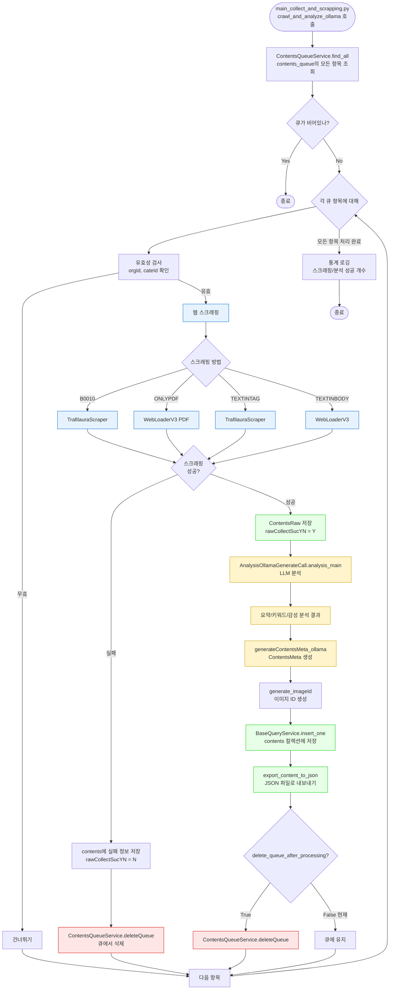

# ContentsScrapingOllamaTrafilaura 클래스 상세 분석

> 작성일: 2025-12-23  
> 분석 대상: `src/docker_scraping/contents_scraping_ollama_trafilaura.py`

---

## 📋 목차

1. [클래스 개요](#1-클래스-개요)
2. [클래스 구조 및 상속](#2-클래스-구조-및-상속)
3. [초기화 메서드 (__init__)](#3-초기화-메서드-__init__)
4. [주요 메서드 분석](#4-주요-메서드-분석)
5. [파일 내 나머지 코드 분석](#5-파일-내-나머지-코드-분석)
6. [데이터 흐름](#6-데이터-흐름)
7. [참고 사항](#7-참고-사항)

---

## 1. 클래스 개요

### 1.1 클래스 정의

```python
class ContentsScrapingOllamaTrafilaura(ContentsScrapingBase):
    '''        
        현재 사용하는 매우 중요한 코드 
        Trafilaura을 사용하여 스크래핑하는 코드 - 현재 이 클래스를 이용하여 스크래핑하고 있음.
    '''
```

**역할**: 
- `contents_queue` 컬렉션의 URL을 읽어서
- 웹 스크래핑 (본문 추출)
- LLM(Ollama) 분석 (요약, 키워드, 감성 분석)
- `contents` 컬렉션에 저장

**중요성**: 현재 프로덕션에서 사용 중인 핵심 클래스

---

## 2. 클래스 구조 및 상속

### 2.1 상속 관계

```
ContentsScrapingBase (부모 클래스)
    ↓
ContentsScrapingOllamaTrafilaura (자식 클래스)
```

**부모 클래스**: `ContentsScrapingBase`
- 위치: `docker_scraping/contents_scraping_base.py`
- 제공 메서드:
  - `generateContentVO()`: `ContentsQueueVO` → `ContentsVO` 변환
  - `generateContentsRaw()`: `ContentsRaw` 객체 생성
  - `generateContentsMeta_ollama()`: LLM 분석 결과를 `ContentsMeta`로 변환
  - `generate_imageId()`: 이미지 ID 생성
  - `generateErrorInfo()`: 에러 정보 생성

### 2.2 클래스 속성 (클래스 레벨)

```python
commCodeService = CommCodeService()
contentsOrgService = ContentsOrgService()
contentsQueueService = ContentsQueueService()
contentsService = ContentsService()
trafilauraScraper = TrafilauraScraper()
docker_scraping_logger = Logger().setup_logger(Logger.docker_scraping_logger_name)
docker_scraping_result_logger = Logger().setup_logger(Logger.docker_scraping_result_logger_name)
```

**특징**: 클래스 변수로 선언되어 모든 인스턴스가 공유

---

## 3. 초기화 메서드 (__init__)

### 3.1 메서드 시그니처

```python
def __init__(self):
```

### 3.2 초기화 과정

#### A. 기관/카테고리 코드 리스트 준비

```python
self.orgCodeList = self.commCodeService.get_org_code_list()
self.cateCodeList = self.commCodeService.get_cate_code_list()
```

**역할**: 유효한 기관 ID와 카테고리 ID 목록 조회

#### B. 기관명/키워드 리스트 준비

```python
self.org_list = CommCodeService().get_org_name_list()
self.keywords = PredefineKeywordService().getKeywordList()
self.org_name_list = []
self.keyword_name_list = []

for org in self.org_list:
    self.org_name_list.append(org["codeName"])

for keyword in self.keywords:
    self.keyword_name_list.append(keyword)

separator = ", "
self.org_name_list = separator.join(self.org_name_list)    # "기관1, 기관2, ..."
self.keyword_name_list = separator.join(self.keyword_name_list)  # "키워드1, 키워드2, ..."
```

**역할**: 
- LLM 프롬프트에 전달할 기관명 리스트 준비
- LLM 프롬프트에 전달할 키워드 리스트 준비
- 쉼표로 구분된 문자열로 변환

#### C. 카운터 초기화

```python
self.scrapping_cnt_for_once = 0  # 한번 실행 시 스크래핑 성공 개수
self.analysis_cnt_for_once = 0    # 한번 실행 시 요약/분석 성공 개수
```

**역할**: 실행 통계 추적

#### D. MongoDB 백업 컬렉션 설정

```python
self.mongo_manager = MongoManager()
self.db = self.mongo_manager.dataBase
self.contents_backup_collection = self.db['contents_backup']
```

**역할**: `contents_backup` 컬렉션에 백업 저장 (today.json 모드)

#### E. JSON Export 설정

```python
self.export_to_json = True
self.json_export_dir = "/app/exports"
Path(self.json_export_dir).mkdir(parents=True, exist_ok=True)
```

**역할**: 처리된 컨텐츠를 JSON 파일로 내보내기

#### F. 큐 삭제 플래그 설정

```python
self.delete_queue_after_processing = False
```

**역할**: 처리 후 `contents_queue`에서 삭제 여부 제어
- `False`: 삭제하지 않음 (현재 설정)
- `True`: 삭제함

---

## 4. 주요 메서드 분석

### 4.1 scrape_content() - 스크래핑 로직 분리

**위치**: Line 102-147

**시그니처**:
```python
def scrape_content(self, queueContent: ContentsQueueVO, webLoader: WebLoaderV3, driver):
    """
    스크래핑 로직만 분리 (테스트 및 재사용 목적)
    Returns: (isSuccess, text, title, contentsVO)
    """
```

**처리 과정**:
1. **유효성 검사**:
   - `queueContent`가 None인지 확인
   - `contentOrgId`가 유효한 기관 코드인지 확인
   - `cateId`가 유효한 카테고리 코드인지 확인

2. **기관/카테고리 정보 조회**:
   ```python
   contentsOrgVO, contentsOrgCategory = self.contentsOrgService.findOrgAndCategory(
       queueContent.contentOrgId, queueContent.cateId
   )
   ```

3. **ContentsVO 생성**:
   ```python
   contentsVO = self.generateContentVO(queueContent)
   ```

4. **스크래핑 방법 분기**:
   ```python
   if contentsOrgCategory.cateId == "B0010":  # 네이버 뉴스
       isSuccess, title, text = self.trafilauraScraper.get_newbody(contentsVO.url)
   else:
       collect_method = contentsOrgCategory.collectMethod.upper()
       
       if collect_method == 'ONLYPDF':
           isSuccess, text = webLoader.loadContents(...)  # PDF만 추출
       elif collect_method == 'TEXTINTAG':
           isSuccess, title, text = self.trafilauraScraper.get_newbody(...)  # Trafilaura
       elif collect_method == 'TEXTINBODY':
           isSuccess, text = webLoader.loadContents(...)  # WebLoaderV3
       else:
           isSuccess, text = webLoader.loadContents(...)  # 기본값
   ```

5. **반환값**:
   - `isSuccess`: 스크래핑 성공 여부 (bool)
   - `text`: 추출된 본문 (str)
   - `title`: 추출된 제목 (str, Trafilaura의 경우)
   - `contentsVO`: 생성된 `ContentsVO` 객체

**특징**: 
- 스크래핑 로직만 분리하여 테스트 및 재사용 가능
- 실제로는 `crawl_and_analyze_one_ollama()`에서 직접 구현되어 있음

---

### 4.2 crawl_and_analyze_ollama() - 메인 처리 메서드

**위치**: Line 149-187

**시그니처**:
```python
def crawl_and_analyze_ollama(self):
    """ contents_queue 정보를 읽어서 스크래핑 및 분석하는 main 
    """
```

**처리 과정**:

#### Step 1: 초기화

```python
webLoader = WebLoaderV3()
driver = get_driver()
validater = data_validator()
ollamaAnalysis = AnalysisOllamaGenerateCall()
```

#### Step 2: 큐 조회 및 빈 큐 체크

```python
queueContents: List[ContentsQueueVO] = self.contentsQueueService.find_all()

if len(queueContents) == 0:
    self.docker_scraping_logger.info(f"Queue is empty")
    return  # 큐가 비어있으면 종료
```

**중요**: 큐가 비어있으면 바로 종료 (처리할 항목 없음)

#### Step 3: 각 큐 항목 처리

```python
for index, contentsQueueVO in enumerate(queueContents):
    self.crawl_and_analyze_one_ollama(contentsQueueVO, webLoader, driver, ollamaAnalysis)
```

#### Step 4: 정리 및 로깅

```python
driver.quit()

# 성공 개수 로깅
self.docker_scraping_logger.info(f"기존 Queue : {len(queueContents)}")
self.docker_scraping_logger.info(f"스크랩 성공 개수 : {self.scrapping_cnt_for_once}")
self.docker_scraping_logger.info(f"요약 및 분석 성공 개수 : {self.analysis_cnt_for_once}")
```

**호출 위치**: `main_collect_and_scrapping.py` (Line 71)

---

### 4.3 crawl_and_analyze_one_ollama() - 단일 항목 처리

**위치**: Line 311-445

**시그니처**:
```python
def crawl_and_analyze_one_ollama(
    self, 
    queueContent: ContentsQueueVO, 
    webLoader: WebLoaderV3, 
    driver, 
    ollamaAnalysis: AnalysisOllamaGenerateCall
):
    """ contents_queue에서 읽은 하나의 url에 대한 스크래핑 및 분석 
    """
```

**처리 과정**:

#### A. 유효성 검사 (Line 314-326)

```python
if queueContent is None:
    return

# 주석처리됨: 중복 체크
# if ContentsService().isExistContents(queueContent.url):
#     return None

if not any(item["code"] == queueContent.contentOrgId for item in self.orgCodeList):
    print(f"orgId : {queueContent.contentOrgId} not exist")
    return False

if not any(queueContent.cateId == item["code"] for item in self.cateCodeList):
    print(f"cateId : {queueContent.cateId} not exist")
    return False
```

**중요**: 
- `ContentsService().isExistContents()` 체크가 주석처리됨
- 따라서 이미 처리된 URL도 다시 처리될 수 있음

#### B. 기관/카테고리 정보 조회 (Line 328-329)

```python
contentsOrgVO, contentsOrgCategory = self.contentsOrgService.findOrgAndCategory(
    queueContent.contentOrgId, queueContent.cateId
)
contentsVO = self.generateContentVO(queueContent)
```

#### C. 웹 스크래핑 (Line 336-353)

```python
contentsVO.rawCollectDt = datetime.now()
scraping_start = time.time()

if contentsOrgCategory.cateId == "B0010":  # 네이버 뉴스
    isSuccess, title, text = self.trafilauraScraper.get_newbody(contentsVO.url)
else:
    collect_method = contentsOrgCategory.collectMethod.upper()
    
    if collect_method == 'ONLYPDF':
        isSuccess, text = webLoader.loadContents(...)
    elif collect_method == 'TEXTINTAG':
        isSuccess, title, text = self.trafilauraScraper.get_newbody(...)
    elif collect_method == 'TEXTINBODY':
        isSuccess, text = webLoader.loadContents(...)
    else:
        isSuccess, text = webLoader.loadContents(...)

scraping_end = time.time()
scraping_duration = scraping_end - scraping_start
```

**스크래핑 방법**:
- `B0010` (네이버 뉴스): Trafilaura 사용
- `ONLYPDF`: PDF만 추출
- `TEXTINTAG`: Trafilaura 사용 (태그 내 텍스트)
- `TEXTINBODY`: WebLoaderV3 사용 (본문 텍스트)

#### D. 스크래핑 실패 처리 (Line 356-369)

```python
if isSuccess == False or text == "" or text == None:
    contentsVO.rawCollectSucYN = "N"
    contentsVO.contentsRaw = self.generateContentsRaw(
        contentsVO.title, 
        contents=text, 
        errorInfo=self.generateErrorInfo(...)
    )
    
    contentsVO = self.generate_imageId(contentsVO)
    BaseQueryService.insert_one(contentsVO)  # 실패 정보도 저장
    ContentsQueueService().deleteQueue(queueContent._id)  # 큐에서 삭제
    return
```

**중요**: 
- 스크래핑 실패 시에도 `contents` 컬렉션에 저장
- **큐에서 삭제**: `ContentsQueueService().deleteQueue(queueContent._id)`

#### E. 스크래핑 성공 처리 (Line 370-380)

```python
self.scrapping_cnt_for_once += 1
contentsVO.rawCollectSucYN = 'Y'
contentsVO.contentsRaw = self.generateContentsRaw(
    contentsVO.title, 
    contents=text, 
    errorInfo=None
)
```

#### F. LLM 분석 (Line 390-413)

```python
ONLY_SCRAPPING = False  # 플래그 (현재 False)
if ONLY_SCRAPPING:
    # 스크래핑만 하고 분석 스킵
    contentsVO.metaSucYN = "N"
    contentsVO.contentsMeta = ContentsMeta(errorInfo=...)
else:
    contentsVO.metaAnalyzeDt = datetime.now()
    analysis_start = time.time()
    
    # LLM 분석 호출
    isSuccess, contentsMetaResult, summary, sentiment, error_ollamaMetaResult, durations = \
        ollamaAnalysis.analysis_main(
            queueContent=queueContent,
            content=text,
            pred_keyword_list=self.keyword_name_list,
            org_name_list=self.org_name_list,
            mycontents_logger=self.docker_scraping_logger
        )
    
    analysis_end = time.time()
    analysis_duration = analysis_end - analysis_start
    
    # 분석 결과를 ContentsVO에 반영
    if isSuccess:
        contentsVO = self.generateContentsMeta_ollama(contentsVO, contentsMetaResult)
    else:
        contentsVO = self.generateContentsMeta_ollama(contentsVO, error_ollamaMetaResult)
    
    # 처리 시간 기록
    if contentsVO.contentsMeta:
        contentsVO.contentsMeta.scrapingDuration = scraping_duration
        contentsVO.contentsMeta.analysisDuration = analysis_duration
    
    # 성공 카운트
    if contentsVO.metaSucYN == "Y":
        ContentsCollectDailyHistoryService().inc_daily_scrapping_cnt()
        self.analysis_cnt_for_once += 1
```

**LLM 분석 내용**:
- 요약 (`short_summary`, `short_summary2`, `long_summary`)
- 키워드 추출 (`predKeywords`, `predKeywords2`)
- 감성 분석 (`positiveRatio`, `negativeRatio`, `neutralRatio`, `positiveKeywords`, `negativeKeywords`, `neutralKeywords`)

#### G. 최종 저장 (Line 419-445)

```python
contentsVO = self.generate_imageId(contentsVO)  # 이미지 ID 생성
total_end = time.time()
total_duration = total_end - total_start

if contentsVO.contentsMeta:
    contentsVO.contentsMeta.totalProcessingDuration = total_duration

try:
    # 본문 내용 제거 (용량 절약)
    if contentsVO and contentsVO.contentsRaw:
        contentsVO.contentsRaw.contents = ""
    
    # MongoDB에 저장
    BaseQueryService.insert_one(contentsVO)
    
    # JSON 파일로 내보내기
    self.export_content_to_json(contentsVO)
    
    # 큐에서 삭제 (조건부)
    if self.delete_queue_after_processing:
        ContentsQueueService().deleteQueue(queueContent._id)
    
except Exception as e:
    # 에러 로깅
```

**중요 사항**:
- **본문 내용 제거**: `contentsVO.contentsRaw.contents = ""` (용량 절약)
- **큐 삭제 조건부**: `delete_queue_after_processing` 플래그에 따라 결정
- **현재 설정**: `delete_queue_after_processing = False` → 삭제하지 않음

---

### 4.4 crawl_and_analyze_one_ollama_test() - 테스트용 메서드

**위치**: Line 190-308

**시그니처**:
```python
def crawl_and_analyze_one_ollama_test(
    self, 
    queueContent: ContentsQueueVO, 
    webLoader: WebLoaderV3, 
    driver, 
    ollamaAnalysis: AnalysisOllamaGenerateCall
):
```

**차이점**:
- `crawl_and_analyze_one_ollama()`와 유사하지만 테스트용
- `ContentsService().isExistContents()` 체크가 활성화됨 (Line 196)
- 주석에 "25.03.13 분석용 함수.당분간 _test함수 유지" 표기

---

### 4.5 scrapping_for_exist_contents() - 기존 컨텐츠 재스크래핑

**위치**: Line 451-483

**시그니처**:
```python
def scrapping_for_exist_contents(self, start_date, end_date, is_all: bool):
    """
    기구축 contents에 스크래핑 메인 함수
    """
```

**처리 과정**:
1. `contents` 컬렉션에서 기존 컨텐츠 조회
2. `rawCollectSucYN == "N"`인 항목만 재스크래핑
3. 스크래핑만 수행 (LLM 분석은 별도)

**사용 목적**: 과거 실패한 스크래핑 재시도

---

### 4.6 scrapping_one_for_exist_contents() - 단일 기존 컨텐츠 재스크래핑

**위치**: Line 485-527

**시그니처**:
```python
def scrapping_one_for_exist_contents(
    self, 
    contentsVO: ContentsVO, 
    webLoader: WebLoaderV3, 
    driver
):
```

**처리 과정**:
1. 기존 `ContentsVO`에서 URL 읽기
2. 스크래핑 수행
3. `contentsService.update_rawCollect(contentsVO)` 호출하여 업데이트

**특징**: LLM 분석은 수행하지 않음 (스크래핑만)

---

### 4.7 analysis_for_exist_contents() - 기존 컨텐츠 LLM 분석

**위치**: Line 531-557

**시그니처**:
```python
def analysis_for_exist_contents(self, start_date, end_date, is_all: bool):
    """
    기구축 contents에 요약, 키워드 추출, 평판 분석 메인 함수
    """
```

**처리 과정**:
1. `contents` 컬렉션에서 `rawCollectSucYN == "Y"`인 항목 조회
2. 각 항목에 대해 LLM 분석 수행
3. `contentsService.update_metaAnalyze(contentsVO)` 호출하여 업데이트

**사용 목적**: 과거 스크래핑은 성공했지만 LLM 분석이 실패한 항목 재분석

---

### 4.8 analysis_one_for_exist_contents() - 단일 기존 컨텐츠 LLM 분석

**위치**: Line 584-627

**시그니처**:
```python
def analysis_one_for_exist_contents(
    self, 
    contentsVO: ContentsVO, 
    analysisOllama: AnalysisOllamaGenerateCall
):
```

**처리 과정**:
1. 기존 `ContentsVO`에서 본문 읽기
2. LLM 분석 수행
3. `contentsService.update_metaAnalyze(contentsVO)` 호출하여 업데이트

**특징**: 스크래핑은 수행하지 않음 (분석만)

---

### 4.9 new_image_id() - 이미지 ID 재할당

**위치**: Line 560-582

**시그니처**:
```python
def new_image_id(self, contentsVO: ContentsVO):
    """
    이미지 id를 다시 할당
    """
```

**처리 과정**:
1. `generate_imageId()` 호출하여 이미지 ID 생성
2. `contentsService.update_imageId(contentsVO)` 호출하여 업데이트

**사용 목적**: 이미지 ID를 다시 할당해야 할 때

---

### 4.10 process_articles_from_today_json() - today.json 처리

**위치**: Line 695-743

**시그니처**:
```python
def process_articles_from_today_json(self):
    """
    Main method to process all articles from today.json and save to contents_backup
    """
```

**처리 과정**:
1. `/app/today.json` 파일에서 기사 정보 추출
2. 각 기사에 대해:
   - `create_queue_content_from_article()`: `ContentsQueueVO` 생성
   - `process_single_article_to_backup()`: 스크래핑 및 분석 수행
   - `contents_backup` 컬렉션에 저장

**호출 위치**: `main_collect_and_scrapping.py` (Line 35, `--today-json` 모드)

---

### 4.11 extract_urls_from_today_json() - today.json 파싱

**위치**: Line 632-693

**시그니처**:
```python
def extract_urls_from_today_json(self, file_path: str = "/app/today.json") -> List[Dict]:
    """
    Extract URLs and metadata from today.json file
    """
```

**처리 과정**:
1. `/app/today.json` 파일 읽기
2. 정규식으로 URL, 제목, 기관 정보, 카테고리 정보, 발행일 추출
3. 중복 URL 제거
4. 딕셔너리 리스트 반환

**추출 필드**:
- `url`: 기사 URL
- `title`: 기사 제목
- `contentsOrgId`: 기관 ID
- `contentsOrgName`: 기관명
- `categoryId`: 카테고리 ID
- `categoryName`: 카테고리명
- `pubDt`: 발행일

---

### 4.12 create_queue_content_from_article() - ContentsQueueVO 생성

**위치**: Line 744-757

**시그니처**:
```python
def create_queue_content_from_article(self, article: Dict) -> ContentsQueueVO:
    """
    Create ContentsQueueVO from article data
    """
```

**처리 과정**:
1. `ContentsQueueVO` 객체 생성
2. 딕셔너리에서 필드 매핑
3. `collectDt`를 현재 시간(UTC)으로 설정
4. `collectKeyword`를 "today_json_processing"으로 설정

---

### 4.13 process_single_article_to_backup() - 단일 기사 백업 처리

**위치**: Line 759-832

**시그니처**:
```python
def process_single_article_to_backup(
    self, 
    queue_content: ContentsQueueVO, 
    webLoader: WebLoaderV3, 
    driver, 
    ollamaAnalysis: AnalysisOllamaGenerateCall
) -> bool:
    """
    Process a single article and save to contents_backup collection
    """
```

**처리 과정**:
1. 기관/카테고리 정보 조회
2. Trafilaura로 스크래핑
3. LLM 분석 수행
4. `save_to_backup_collection()` 호출하여 `contents_backup`에 저장

**특징**: 
- `contents` 컬렉션이 아닌 `contents_backup` 컬렉션에 저장
- `contents_queue`에는 저장하지 않음

---

### 4.14 save_to_backup_collection() - 백업 컬렉션 저장

**위치**: Line 834-853

**시그니처**:
```python
def save_to_backup_collection(self, contentsVO: ContentsVO):
    """
    Save ContentsVO to contents_backup collection
    """
```

**처리 과정**:
1. `ContentsVO`를 딕셔너리로 변환 (`to_mongo()`)
2. 백업 메타데이터 추가:
   - `backup_created_at`: 현재 시간(UTC)
   - `backup_source`: "today_json_processing"
3. `contents_backup` 컬렉션에 저장

---

### 4.15 export_content_to_json() - JSON 파일 내보내기

**위치**: Line 855-894

**시그니처**:
```python
def export_content_to_json(self, contentsVO: ContentsVO):
    """
    Export a single processed content to JSON file with pretty formatting
    """
```

**처리 과정**:
1. `export_to_json` 플래그 확인 (기본값: `True`)
2. `ContentsVO`를 딕셔너리로 변환
3. `ObjectId`를 문자열로 변환
4. `datetime` 객체를 ISO 형식 문자열로 변환
5. 파일명 생성: `{모델명}_content_{타임스탬프}_{URL해시}.json`
6. `/app/exports` 디렉토리에 저장

**파일명 예시**: `gpt-oss-20b_content_20251223_143022_abc12345.json`

---

## 5. 파일 내 나머지 코드 분석

### 5.1 Import 문 (Line 1-47)

**표준 라이브러리**:
- `sys`, `traceback`: 에러 처리
- `datetime`, `timedelta`, `timezone`: 날짜/시간 처리
- `time`: 시간 측정
- `json`: JSON 처리
- `re`: 정규식
- `pytz`: 타임존 처리
- `os`, `Path`: 파일 시스템

**커스텀 모듈**:
- `docker_collect.driver_utils`: Selenium 드라이버
- `docker_scraping.web_loader`: WebLoaderV3
- `docker_scraping.ai_scraping.trafilaura`: TrafilauraScraper
- `ksubscribe_server.analysis.analysis_ollama_generate`: AnalysisOllamaGenerateCall
- `ksubscribe_share.db.*`: 데이터베이스 서비스 및 모델

### 5.2 if __name__ == "__main__" 블록 (Line 895-910)

```python
if __name__ == "__main__":
    contentsScrapingOllamaTrafilaura = ContentsScrapingOllamaTrafilaura()
    
    # Regular scraping from contents_queue
    # contentsScrapingOllamaTrafilaura.crawl_and_analyze_ollama()
    
    # Process URLs from today.json and save to contents_backup collection
    # contentsScrapingOllamaTrafilaura.process_articles_from_today_json()
    
    # Other methods
    #contentsScrapingOllamaTrafilaura.scrapping_for_exist_contents()
    # contentsScrapingOllamaTrafilaura.analysis_for_exist_contents()
    contentsScrapingOllamaTrafilaura.crawl_and_analyze_ollama()
```

**역할**: 직접 실행 시 테스트용
**현재 활성화**: `crawl_and_analyze_ollama()`만 활성화

---

## 6. 데이터 흐름

### 6.1 전체 데이터 흐름도



### 6.2 큐 삭제 로직 상세

```
스크래핑 실패 시:
    ✅ 항상 큐에서 삭제 (Line 367)
    ✅ contents에 실패 정보 저장

스크래핑 성공 시:
    if delete_queue_after_processing == True:
        ✅ 큐에서 삭제 (Line 438-439)
    else:  # 현재 설정
        ❌ 큐에 유지 (삭제하지 않음)
```

**현재 설정**: `delete_queue_after_processing = False`
- 성공 시에도 큐에서 삭제하지 않음
- 결과: 큐에 항목이 계속 남아있어 재처리 가능

---

## 7. 참고 사항

### 7.1 상속받은 메서드 (ContentsScrapingBase)

이 클래스에서 사용하는 부모 클래스 메서드:

1. **`generateContentVO(queueContent)`**:
   - `ContentsQueueVO` → `ContentsVO` 변환
   - 기관명, 카테고리명 자동 조회

2. **`generateContentsRaw(title, contents, errorInfo)`**:
   - `ContentsRaw` 객체 생성
   - 본문, 제목, 에러 정보 포함

3. **`generateContentsMeta_ollama(contentsVO, contentsMetaResult)`**:
   - LLM 분석 결과를 `ContentsMeta`로 변환
   - 성공/실패 처리

4. **`generate_imageId(contentsVO)`**:
   - 이미지 ID 생성
   - 우선순위: `predKeywords` → 제목 유사도 → 기본 이미지

5. **`generateErrorInfo(errorYN, date, type, reason)`**:
   - 에러 정보 객체 생성

### 7.2 주요 설정값

| 설정 | 값 | 설명 |
|------|-----|------|
| `delete_queue_after_processing` | `False` | 처리 후 큐에서 삭제하지 않음 |
| `export_to_json` | `True` | JSON 파일로 내보내기 활성화 |
| `json_export_dir` | `/app/exports` | JSON 파일 저장 디렉토리 |
| `ONLY_SCRAPPING` | `False` | 스크래핑만 하고 분석 스킵하지 않음 |

### 7.3 에러 처리

- **스크래핑 실패**: `contents`에 실패 정보 저장, 큐에서 삭제
- **LLM 분석 실패**: `contentsMeta`에 에러 정보 저장, 큐는 유지 (설정에 따라)
- **예외 발생**: try-except로 감싸서 로깅 후 계속 진행

### 7.4 성능 측정

- `scraping_duration`: 스크래핑 소요 시간
- `analysis_duration`: LLM 분석 소요 시간
- `totalProcessingDuration`: 전체 처리 소요 시간
- `contentsMeta.scrapingDuration`, `contentsMeta.analysisDuration`에 저장

---

## 8. 메서드 요약표

| 메서드명 | 역할 | 호출 위치 |
|---------|------|----------|
| `__init__()` | 초기화 (기관/키워드 리스트 준비) | 인스턴스 생성 시 |
| `scrape_content()` | 스크래핑 로직만 분리 (재사용 목적) | 현재 미사용 |
| `crawl_and_analyze_ollama()` | 메인 처리 메서드 (큐 전체 처리) | `main_collect_and_scrapping.py` |
| `crawl_and_analyze_one_ollama()` | 단일 항목 처리 (스크래핑 + 분석) | `crawl_and_analyze_ollama()` |
| `crawl_and_analyze_one_ollama_test()` | 테스트용 단일 항목 처리 | 테스트 스크립트 |
| `scrapping_for_exist_contents()` | 기존 컨텐츠 재스크래핑 | 별도 스크립트 |
| `scrapping_one_for_exist_contents()` | 단일 기존 컨텐츠 재스크래핑 | `scrapping_for_exist_contents()` |
| `analysis_for_exist_contents()` | 기존 컨텐츠 LLM 분석 | 별도 스크립트 |
| `analysis_one_for_exist_contents()` | 단일 기존 컨텐츠 LLM 분석 | `analysis_for_exist_contents()` |
| `new_image_id()` | 이미지 ID 재할당 | 별도 스크립트 |
| `process_articles_from_today_json()` | today.json 처리 | `main_collect_and_scrapping.py` (`--today-json`) |
| `extract_urls_from_today_json()` | today.json 파싱 | `process_articles_from_today_json()` |
| `create_queue_content_from_article()` | ContentsQueueVO 생성 | `process_articles_from_today_json()` |
| `process_single_article_to_backup()` | 단일 기사 백업 처리 | `process_articles_from_today_json()` |
| `save_to_backup_collection()` | 백업 컬렉션 저장 | `process_single_article_to_backup()` |
| `export_content_to_json()` | JSON 파일 내보내기 | `crawl_and_analyze_one_ollama()` |

---

## 9. 핵심 발견 사항

### 9.1 큐 삭제 로직

**현재 상태**:
- 스크래핑 실패 시: 항상 삭제 ✅
- 스크래핑 성공 시: `delete_queue_after_processing = False` → 삭제하지 않음 ❌

**영향**:
- 큐에 항목이 계속 남아있어 재처리 가능
- `main_collect_and_scrapping.py`의 2차 실행에서 중복 처리 발생

### 9.2 중복 체크 비활성화

**현재 상태**:
- `ContentsService().isExistContents()` 체크가 주석처리됨 (Line 316-318)

**영향**:
- 이미 처리된 URL도 다시 처리됨
- `contents` 컬렉션에 중복 저장 가능

### 9.3 본문 내용 제거

**현재 상태**:
- 저장 전에 `contentsVO.contentsRaw.contents = ""`로 본문 제거 (Line 427-428)

**목적**: MongoDB 용량 절약

**영향**:
- 저장 후에는 본문을 읽을 수 없음
- 재분석 시 원문이 필요하면 다시 스크래핑해야 함

---

## 10. 참고 파일

- **부모 클래스**: `docker_scraping/contents_scraping_base.py`
- **호출 위치**: `docker_shell/main_collect_and_scrapping.py`
- **LLM 분석**: `ksubscribe_server/analysis/analysis_ollama_generate.py`
- **데이터 모델**: `ksubscribe_share/db/dbmodelV2/contentsVO.py`
- **큐 서비스**: `ksubscribe_share/db/service/contentsQueueService.py`


