# 데이터 흐름 분석 문서

> 작성일: 2025-01-XX  
> 분석 대상: `main_collect_and_scrapping.py` 실행 시 데이터 흐름

---

## 📋 목차

1. [개요](#1-개요)
2. [전체 데이터 흐름도](#2-전체-데이터-흐름도)
3. [단계별 상세 분석](#3-단계별-상세-분석)
4. [중간 결과물 데이터 구조](#4-중간-결과물-데이터-구조)
5. [MongoDB Collection 구조](#5-mongodb-collection-구조)

---

## 1. 개요

`main_collect_and_scrapping.py`는 MongoDB의 `contents_org` collection을 입력으로 받아, 최종적으로 LLM 분석 결과가 포함된 `contents` collection에 데이터를 저장하는 파이프라인입니다.

### 주요 처리 단계

1. **수집 단계 (Collect)**: 웹사이트에서 URL 수집
2. **큐 저장 단계**: 수집된 URL을 큐에 저장
3. **스크래핑 단계**: URL에서 실제 콘텐츠 추출
4. **LLM 분석 단계**: 추출된 텍스트를 LLM으로 분석
5. **최종 저장 단계**: 분석 결과를 DB에 저장

---

## 2. 전체 데이터 흐름도

```mermaid
flowchart TB
    Start([main_collect_and_scrapping.py<br/>시작]) --> Collect[1. DockerCollectMain.distribute<br/>URL 수집]
    
    Collect --> ReadOrg[contents_org collection<br/>기관 정보 조회]
    ReadOrg --> LoopOrg{각 기관별<br/>루프}
    
    LoopOrg --> LoopCate{각 카테고리별<br/>루프}
    LoopCate --> CollectMethod{수집 방법}
    
    CollectMethod -->|C0003| Selenium[Selenium 수집<br/>get_contents_by_selenium_main]
    CollectMethod -->|C0001| RSS[RSS 수집<br/>get_contents_by_rss]
    CollectMethod -->|C0002| OpenAPI[Open API 수집<br/>get_naver_news / get_g2b_nara]
    
    Selenium --> CollectDetail[ContentsCollectDetail<br/>생성]
    RSS --> CollectDetail
    OpenAPI --> CollectDetail
    
    CollectDetail --> SaveHistory[contents_collect_history<br/>저장]
    SaveHistory --> SaveQueue[contents_queue<br/>저장]
    
    SaveQueue --> Scraping[2. ContentsScrapingOllamaTrafilaura<br/>crawl_and_analyze_ollama]
    
    Scraping --> ReadQueue[contents_queue<br/>조회]
    ReadQueue --> LoopQueue{각 큐 항목별<br/>루프}
    
    LoopQueue --> Validate[유효성 검사<br/>orgId, cateId 확인]
    Validate -->|무효| Skip[건너뛰기]
    Validate -->|유효| ScrapeMethod{스크래핑<br/>방법}
    
    ScrapeMethod -->|B0010| Trafilaura1[TrafilauraScraper<br/>get_newbody]
    ScrapeMethod -->|ONLYPDF| PDF[WebLoaderV3<br/>PDF 수집]
    ScrapeMethod -->|TEXTINTAG| Trafilaura2[TrafilauraScraper<br/>get_newbody]
    ScrapeMethod -->|TEXTINBODY| WebLoader[WebLoaderV3<br/>텍스트 수집]
    
    Trafilaura1 --> CheckScrape{스크래핑<br/>성공?}
    PDF --> CheckScrape
    Trafilaura2 --> CheckScrape
    WebLoader --> CheckScrape
    
    CheckScrape -->|실패| SaveFail[ContentsVO 생성<br/>rawCollectSucYN = N<br/>contentsRaw 저장]
    SaveFail --> SaveContentsFail[contents collection<br/>실패 정보 저장]
    SaveContentsFail --> DeleteQueue1[contents_queue<br/>삭제]
    DeleteQueue1 --> NextQueue[다음 항목]
    
    CheckScrape -->|성공| SaveRaw[ContentsRaw 생성<br/>rawCollectSucYN = Y<br/>title, contents 저장]
    SaveRaw --> LLMAnalysis[3. AnalysisOllamaGenerateCall<br/>analysis_main]
    
    LLMAnalysis --> LLMInput[LLM 입력:<br/>- content: 스크래핑된 텍스트<br/>- pred_keyword_list: 사전 정의 키워드<br/>- org_name_list: 기관명 리스트]
    
    LLMInput --> LLMProcess[Ollama LLM<br/>처리]
    LLMProcess --> LLMOutput[LLM 출력:<br/>- shortSummary<br/>- longSummary<br/>- predKeywords<br/>- sentiments]
    
    LLMOutput --> GenerateMeta[generateContentsMeta_ollama<br/>ContentsMeta 생성]
    GenerateMeta --> GenerateImage[generate_imageId<br/>이미지 ID 생성]
    GenerateImage --> SaveContents[BaseQueryService.insert_one<br/>contents collection 저장]
    
    SaveContents --> ExportJSON[export_content_to_json<br/>JSON 파일로 내보내기]
    ExportJSON --> CheckDelete{delete_queue_after_processing?}
    CheckDelete -->|True| DeleteQueue2[contents_queue<br/>삭제]
    CheckDelete -->|False| KeepQueue[큐에 유지]
    
    DeleteQueue2 --> NextQueue
    KeepQueue --> NextQueue
    Skip --> NextQueue
    
    NextQueue --> MoreQueue{더 많은<br/>큐 항목?}
    MoreQueue -->|Yes| LoopQueue
    MoreQueue -->|No| Stats[4. 통계 계산<br/>StatsService]
    
    Stats --> End([종료])
    
    style Start fill:#e1f5ff
    style End fill:#ffe1f5
    style Collect fill:#fff4e1
    style Scraping fill:#fff4e1
    style LLMAnalysis fill:#e1ffe1
    style SaveContents fill:#ffe1f5
```



---

## 3. 단계별 상세 분석

### 3.1 수집 단계 (Collect Phase)

**파일**: `collect_v2.py`  
**함수**: `DockerCollectMain.distribute()`

#### 입력 데이터
- **MongoDB Collection**: `contents_org`
- **데이터 구조**: `ContentsOrgVO`
  ```python
  {
    "orgId": "A0010",
    "orgName": "한국전력공사(주)",
    "categoryList": [
      {
        "cateId": "B0001",
        "cateName": "보도자료",
        "COL_METHOD": "C0003",  # 수집 방법
        "collectUrlInfo": "https://...",
        "APIKEY1": "...",
        "APIKEY2": "...",
        # ... 기타 설정
      }
    ]
  }
  ```

#### 처리 과정

1. **기관 정보 조회**
   ```python
   contentsOrgList = ContentsOrgService().find_all()
   # IS_USE = True인 모든 기관 조회
   ```

2. **각 기관/카테고리별 수집**
   - `COL_METHOD`에 따라 수집 방법 결정:
     - `C0003`: Selenium (웹 크롤링)
     - `C0001`: RSS 피드
     - `C0002`: Open API (네이버 뉴스, 나라장터)

3. **수집 결과 생성**
   ```python
   ContentsCollectDetail {
     title: str,
     url: str,
     pubDt: datetime,
     shortUrl: str,
     sucYN: bool
   }
   ```

#### 중간 결과물

**Collection**: `contents_collect_history`
```json
{
  "contentOrgId": "A0010",
  "collectDt": "2025-01-XX",
  "contentCollectList": [
    {
      "categoryId": "B0001",
      "collectionDetailList": [
        {
          "title": "...",
          "url": "https://...",
          "pubDt": "...",
          "sucYN": "Y"
        }
      ]
    }
  ]
}
```

**Collection**: `contents_queue`
```json
{
  "contentOrgId": "A0010",
  "cateId": "B0001",
  "title": "...",
  "url": "https://...",
  "pubDt": "...",
  "collectDt": "...",
  "collectKeyword": "..."
}
```

---

### 3.2 스크래핑 단계 (Scraping Phase)

**파일**: `contents_scraping_ollama_trafilaura.py`  
**함수**: `ContentsScrapingOllamaTrafilaura.crawl_and_analyze_ollama()`

#### 입력 데이터
- **MongoDB Collection**: `contents_queue`
- **데이터 구조**: `ContentsQueueVO`
  ```python
  {
    "contentOrgId": "A0010",
    "cateId": "B0001",
    "title": "...",
    "url": "https://...",
    "pubDt": "...",
    "collectDt": "..."
  }
  ```

#### 처리 과정

1. **큐에서 항목 조회**
   ```python
   queueContents = ContentsQueueService().find_all()
   ```

2. **각 URL별 스크래핑**
   - 카테고리 ID 또는 `collectMethod`에 따라 스크래핑 방법 결정:
     - `B0010` (네이버 뉴스): `TrafilauraScraper.get_newbody()`
     - `ONLYPDF`: `WebLoaderV3.loadContents()` (PDF)
     - `TEXTINTAG`: `TrafilauraScraper.get_newbody()`
     - `TEXTINBODY`: `WebLoaderV3.loadContents()` (텍스트)

3. **스크래핑 결과 저장**
   ```python
   ContentsRaw {
     title: str,
     contents: str,  # 스크래핑된 본문 텍스트
     image: str,
     errorInfo: ErrorInfo (optional)
   }
   ```

#### 중간 결과물

**메모리 객체**: `ContentsVO` (부분)
```python
{
  "title": "...",
  "url": "https://...",
  "contentsOrgId": "A0010",
  "categoryId": "B0001",
  "rawCollectSucYN": "Y",  # 또는 "N"
  "rawCollectDt": datetime,
  "contentsRaw": {
    "title": "...",
    "contents": "스크래핑된 본문 텍스트...",
    "image": None,
    "errorInfo": None
  }
}
```

---

### 3.3 LLM 분석 단계 (LLM Analysis Phase)

**파일**: `contents_scraping_ollama_trafilaura.py`  
**함수**: `AnalysisOllamaGenerateCall.analysis_main()`

#### 입력 데이터
- **content**: 스크래핑된 텍스트 (`ContentsRaw.contents`)
- **pred_keyword_list**: 사전 정의 키워드 리스트 (예: "에너지, 탄소중립, 원전, ...")
- **org_name_list**: 기관명 리스트 (예: "한국전력공사, 한국전력, ...")
- **queueContent**: 큐 정보 (선택적)

#### 처리 과정

1. **LLM 프롬프트 생성**
   - 요약 프롬프트: 본문을 요약
   - 키워드 추출 프롬프트: 사전 정의 키워드 중 관련 키워드 추출
   - 감성 분석 프롬프트: 긍정/부정/중립 비율 및 키워드 분석

2. **Ollama LLM 호출**
   ```python
   ollamaAnalysis.analysis_main(
     queueContent=queueContent,
     content=text,
     pred_keyword_list=self.keyword_name_list,
     org_name_list=self.org_name_list
   )
   ```

3. **LLM 응답 파싱**
   - JSON 형식으로 응답 받음
   - 각 필드 추출 및 검증

#### LLM 출력 데이터

**메모리 객체**: `ContentsMetaResult`
```python
{
  "metaSucYN": "Y",
  "shortSummary": "요약 텍스트...",
  "shortSummary2": "기관명 제거된 요약...",
  "longSummary": "상세 요약 텍스트...",
  "predKeywords": {
    "에너지": 0.85,
    "원전": 0.72,
    ...
  },
  "predKeywords2": {
    "에너지": 0.85,
    ...
  },
  "sentiments": [
    {
      "orgId": "A0010",
      "orgName": "한국전력공사(주)",
      "positiveRatio": 0.6,
      "negativeRatio": 0.2,
      "neutralRatio": 0.2,
      "positiveKeywords": ["발전", "혁신"],
      "negativeKeywords": ["비용"],
      "neutralKeywords": ["보고"]
    }
  ]
}
```

#### 중간 결과물

**메모리 객체**: `ContentsVO` (업데이트)
```python
{
  # ... 기존 필드 ...
  "metaSucYN": "Y",
  "metaAnalyzeDt": datetime,
  "contentsMeta": {
    "shortSummary": "...",
    "longSummary": "...",
    "predKeywords": {...},
    "sentiments": [...],
    "method": "ollama"
  }
}
```

---

### 3.4 최종 저장 단계 (Final Storage Phase)

**파일**: `contents_scraping_ollama_trafilaura.py`  
**함수**: `BaseQueryService.insert_one()`

#### 처리 과정

1. **이미지 ID 생성**
   ```python
   contentsVO = generate_imageId(contentsVO)
   ```

2. **본문 내용 제거** (용량 절약)
   ```python
   if contentsVO.contentsRaw:
     contentsVO.contentsRaw.contents = ""
   ```

3. **MongoDB 저장**
   ```python
   BaseQueryService.insert_one(contentsVO)
   ```

4. **JSON 파일 내보내기** (선택적)
   ```python
   export_content_to_json(contentsVO)
   # /app/exports/{model_name}_content_{timestamp}_{url_hash}.json
   ```

5. **큐 삭제** (설정에 따라)
   ```python
   if delete_queue_after_processing:
     ContentsQueueService().deleteQueue(queueContent._id)
   ```

#### 최종 결과물

**MongoDB Collection**: `contents`
```json
{
  "_id": ObjectId("..."),
  "title": "...",
  "url": "https://...",
  "contentsOrgId": "A0010",
  "categoryId": "B0001",
  "pubDt": ISODate("..."),
  "collectDt": ISODate("..."),
  "rawCollectSucYN": "Y",
  "rawCollectDt": ISODate("..."),
  "contentsRaw": {
    "title": "...",
    "contents": "",  // 저장 시 제거됨
    "image": null,
    "errorInfo": null
  },
  "metaSucYN": "Y",
  "metaAnalyzeDt": ISODate("..."),
  "contentsMeta": {
    "shortSummary": "요약 텍스트...",
    "shortSummary2": "기관명 제거된 요약...",
    "longSummary": "상세 요약...",
    "predKeywords": {
      "에너지": 0.85,
      "원전": 0.72
    },
    "predKeywords2": {
      "에너지": 0.85
    },
    "sentiments": [
      {
        "orgId": "A0010",
        "orgName": "한국전력공사(주)",
        "positiveRatio": 0.6,
        "negativeRatio": 0.2,
        "neutralRatio": 0.2,
        "positiveKeywords": ["발전", "혁신"],
        "negativeKeywords": ["비용"],
        "neutralKeywords": ["보고"]
      }
    ],
    "method": "ollama"
  },
  "imageId": "..."
}
```

**JSON 파일**: `/app/exports/{model_name}_content_{timestamp}_{url_hash}.json`
- 위와 동일한 구조를 JSON 형식으로 저장

---

## 4. 중간 결과물 데이터 구조

### 4.1 ContentsOrgVO (입력)

```python
ContentsOrgVO {
  orgId: str                    # 기관 ID (예: "A0010")
  orgName: str                  # 기관명 (예: "한국전력공사(주)")
  orgKeywordList: List[str]     # 기관 키워드 리스트
  categoryList: List[ContentsOrgCategory]  # 카테고리 리스트
}

ContentsOrgCategory {
  cateId: str                   # 카테고리 ID (예: "B0001")
  cateName: str                 # 카테고리명 (예: "보도자료")
  COL_METHOD: str               # 수집 방법 ("C0003", "C0001", "C0002")
  collectUrlInfo: str           # 수집 URL
  collectMethod: str            # 스크래핑 방법 ("onlyPDF", "textInTag", "textInBody")
  APIKEY1: str                  # API 키 1
  APIKEY2: str                  # API 키 2
  keywords: List[str]           # 카테고리 키워드
  # ... 기타 Selenium 설정 필드들
}
```

### 4.2 ContentsCollectDetail (수집 결과)

```python
ContentsCollectDetail {
  title: str                     # 제목
  url: str                      # URL
  pubDt: datetime               # 발행일
  shortUrl: str                 # 짧은 URL (랜덤 문자열)
  sucYN: bool                   # 성공 여부
  naverUrl: str (optional)      # 네이버 URL (네이버 뉴스인 경우)
}
```

### 4.3 ContentsQueueVO (큐 항목)

```python
ContentsQueueVO {
  contentOrgId: str             # 기관 ID
  cateId: str                   # 카테고리 ID
  title: str                    # 제목
  url: str                      # URL
  pubDt: datetime               # 발행일
  collectDt: datetime           # 수집일
  collectKeyword: str           # 수집 키워드
  shortUrl: str                 # 짧은 URL
}
```

### 4.4 ContentsRaw (스크래핑 결과)

```python
ContentsRaw {
  title: str                    # 제목
  contents: str                # 본문 텍스트 (스크래핑된 내용)
  image: str (optional)        # 이미지 URL
  errorInfo: ErrorInfo (optional)  # 에러 정보
}
```

### 4.5 ContentsMeta (LLM 분석 결과)

```python
ContentsMeta {
  shortSummary: str             # 짧은 요약
  shortSummary2: str            # 기관명 제거된 짧은 요약
  longSummary: str              # 긴 요약
  longDetailSummaryFormat1-5: str  # 상세 요약 (다양한 포맷)
  predKeywords: Dict[str, float]  # 키워드 및 점수 (shortSummary 기반)
  predKeywords2: Dict[str, float] # 키워드 및 점수 (shortSummary2 기반)
  sentiments: List[SentimentInfo] # 감성 분석 결과
  method: str                   # 분석 방법 ("ollama", "gpt4o")
  llmSummaryMeta: LLMAnalysisMeta  # LLM 요약 메타데이터
  llmSentimentMeta: LLMAnalysisMeta # LLM 감성 분석 메타데이터
}

SentimentInfo {
  orgId: str                    # 기관 ID
  orgName: str                  # 기관명
  positiveRatio: float          # 긍정 비율 (0.0 ~ 1.0)
  negativeRatio: float          # 부정 비율 (0.0 ~ 1.0)
  neutralRatio: float           # 중립 비율 (0.0 ~ 1.0)
  reason: str                   # 종합 판단 근거
  positiveReason: str           # 긍정 판단 근거
  negativeReason: str            # 부정 판단 근거
  neutralReason: str            # 중립 판단 근거
  positiveKeywords: List[str]   # 긍정 키워드
  negativeKeywords: List[str]    # 부정 키워드
  neutralKeywords: List[str]    # 중립 키워드
}
```

### 4.6 ContentsVO (최종 결과)

```python
ContentsVO {
  # 기본 정보
  title: str
  url: str
  contentsOrgId: str
  categoryId: str
  pubDt: datetime
  collectDt: datetime
  collectKeyword: str
  
  # 스크래핑 정보
  rawCollectSucYN: str          # "Y" 또는 "N"
  rawCollectDt: datetime
  contentsRaw: ContentsRaw
  
  # LLM 분석 정보
  metaSucYN: str                # "Y" 또는 "N"
  metaAnalyzeDt: datetime
  contentsMeta: ContentsMeta
  
  # 기타
  imageId: str
  lookCount: int
  likeCount: int
  # ...
}
```

---

## 5. MongoDB Collection 구조

### 5.1 contents_org (입력)

```json
{
  "_id": ObjectId("..."),
  "orgId": "A0010",
  "orgName": "한국전력공사(주)",
  "orgKeywordList": ["한국전력공사", "한국전력"],
  "categoryList": [
    {
      "cateId": "B0001",
      "cateName": "보도자료",
      "COL_METHOD": "C0003",
      "collectUrlInfo": "https://...",
      "collectMethod": "onlyPDF",
      "keywords": ["에너지", "탄소중립"],
      // ... 기타 필드
    }
  ],
  "IS_USE": true
}
```

### 5.2 contents_collect_history (수집 이력)

```json
{
  "_id": ObjectId("..."),
  "contentOrgId": "A0010",
  "collectDt": ISODate("2025-01-XX"),
  "contentCollectList": [
    {
      "categoryId": "B0001",
      "collectionDetailList": [
        {
          "title": "...",
          "url": "https://...",
          "pubDt": ISODate("..."),
          "sucYN": "Y"
        }
      ]
    }
  ]
}
```

### 5.3 contents_queue (큐)

```json
{
  "_id": ObjectId("..."),
  "contentOrgId": "A0010",
  "cateId": "B0001",
  "title": "...",
  "url": "https://...",
  "pubDt": ISODate("..."),
  "collectDt": ISODate("..."),
  "collectKeyword": "...",
  "shortUrl": "..."
}
```

### 5.4 contents (최종 결과)

```json
{
  "_id": ObjectId("..."),
  "title": "...",
  "url": "https://...",
  "contentsOrgId": "A0010",
  "categoryId": "B0001",
  "pubDt": ISODate("..."),
  "collectDt": ISODate("..."),
  "rawCollectSucYN": "Y",
  "rawCollectDt": ISODate("..."),
  "contentsRaw": {
    "title": "...",
    "contents": "",  // 저장 시 제거됨
    "image": null
  },
  "metaSucYN": "Y",
  "metaAnalyzeDt": ISODate("..."),
  "contentsMeta": {
    "shortSummary": "...",
    "longSummary": "...",
    "predKeywords": {
      "에너지": 0.85
    },
    "sentiments": [
      {
        "orgId": "A0010",
        "orgName": "한국전력공사(주)",
        "positiveRatio": 0.6,
        "negativeRatio": 0.2,
        "neutralRatio": 0.2,
        "positiveKeywords": ["발전"],
        "negativeKeywords": ["비용"],
        "neutralKeywords": ["보고"]
      }
    ],
    "method": "ollama"
  },
  "imageId": "..."
}
```

---

## 6. 데이터 변환 요약

| 단계 | 입력 | 출력 | 변환 내용 |
|------|------|------|-----------|
| **1. 수집** | `contents_org` | `contents_queue` | 웹사이트에서 URL 추출 → 큐에 저장 |
| **2. 스크래핑** | `contents_queue` | `ContentsRaw` | URL에서 본문 텍스트 추출 |
| **3. LLM 분석** | `ContentsRaw.contents` | `ContentsMeta` | 텍스트 → 요약/키워드/감성 분석 |
| **4. 저장** | `ContentsVO` | `contents` collection | 최종 결과를 MongoDB에 저장 |

---

## 7. 주요 특징

### 7.1 비동기 처리
- 수집과 스크래핑은 별도 단계로 분리
- `contents_queue`를 통해 두 단계 간 데이터 전달

### 7.2 에러 처리
- 각 단계에서 실패 시에도 데이터 저장
- `rawCollectSucYN`, `metaSucYN`으로 성공/실패 추적
- `ErrorInfo` 객체로 상세 에러 정보 저장

### 7.3 용량 최적화
- 최종 저장 시 `contentsRaw.contents`를 빈 문자열로 설정하여 용량 절약
- 원본 텍스트는 스크래핑 시점에만 메모리에 존재

### 7.4 JSON 백업
- 처리된 각 항목을 JSON 파일로 내보내기
- 디버깅 및 백업 목적

---

## 8. 참고 사항

- **큐 삭제 정책**: `delete_queue_after_processing` 플래그로 제어 (현재 `False`)
- **LLM 모델**: 환경 변수 `OLLAMA_MODEL`로 설정
- **통계 계산**: `main_collect_and_scrapping.py`의 마지막 단계에서 통계 계산 수행

---

**문서 작성자**: AI Assistant  
**최종 수정일**: 2025-01-XX

