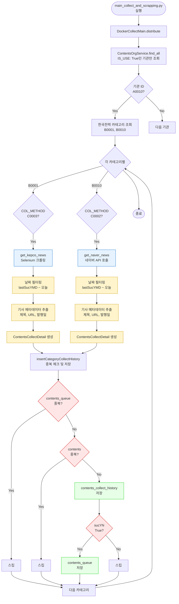

# 한국전력(A0010) 기사 및 공고 수집 과정 상세 가이드

> 작성일: 2025-12-24  
> 분석 대상: 한국전력공사(A0010)의 기사 및 공고 수집 과정 (`contents_org` → `contents_queue`)

---

## 📋 목차

1. [개요](#1-개요)
2. [한국전력(A0010) 카테고리 정보](#2-한국전력a0010-카테고리-정보)
3. [전체 수집 흐름도](#3-전체-수집-흐름도)
4. [카테고리별 수집 과정](#4-카테고리별-수집-과정)
5. [데이터 저장 구조](#5-데이터-저장-구조)
6. [중복 체크 메커니즘](#6-중복-체크-메커니즘)
7. [실제 실행 예시](#7-실제-실행-예시)

---

## 1. 개요

### 1.1 입력 데이터
- **MongoDB Collection**: `contents_org`
- **기관 ID**: `A0010` (한국전력공사(주))
- **기관명**: `한국전력공사(주)`
- **기관 URL**: `https://home.kepco.co.kr`

### 1.2 출력 데이터
- **MongoDB Collection**: `contents_queue`
- **저장 내용**: 기사/공고의 메타데이터 (제목, URL, 발행일 등)
- **저장되지 않는 것**: 기사 본문 (나중에 스크래핑 단계에서 추출)

### 1.3 수집 대상 카테고리
한국전력(A0010)은 **2개의 카테고리**를 가지고 있습니다:

| 카테고리 ID | 카테고리명 | 수집 방식 | COL_METHOD | 플랫폼/서비스 |
|------------|-----------|----------|------------|--------------|
| B0001 | 보도자료 | Selenium | C0003 | 한국전력공사 홈페이지 |
| B0010 | 네이버 뉴스 | Open API | C0002 | 네이버 뉴스 검색 API |

---

## 2. 한국전력(A0010) 카테고리 정보

### 2.1 보도자료 (B0001)

#### MongoDB 저장 정보
```json
{
  "cateId": "B0001",
  "cateName": "보도자료",
  "COL_METHOD": "C0003",
  "collectUrlInfo": "https://home.kepco.co.kr/kepco/PR/ntcob/list.do?boardSeq=0&boardCd=BRD_000117&menuCd=FN060306&parnScrpSeq=0&searchCondition=total&searchKeyword&pageIndex=",
  "pageUrlInfo": "https://home.kepco.co.kr/kepco/PR/ntcob/list.do?boardCd=BRD_000117&menuCd=FN060306",
  "keywords": ["에너지", "탄소중립", "UAE", "원전", "연료비"],
  "APIKEY1": null,
  "APIKEY2": null,
  "collectMethod": "onlyPDF",
  "lastSucYMD": "2025-08-21T21:00:38.852Z"
}
```

#### 특징
- **수집 방식**: Selenium (웹 브라우저 자동화)
- **API KEY**: 불필요 (null)
- **사용 함수**: `get_kepco_news(driver, contentsOrg, category)`
- **특수 처리**: 한국전력 보도자료는 별도의 함수 사용

### 2.2 네이버 뉴스 (B0010)

#### MongoDB 저장 정보
```json
{
  "cateId": "B0010",
  "cateName": "네이버 뉴스",
  "COL_METHOD": "C0002",
  "collectUrlInfo": "https://openapi.naver.com/v1/search/news.json?display=100&start=1&sort=sim&query=",
  "pageUrlInfo": "https://openapi.naver.com/v1/search/news.json?display=100&start=1&sort=sim&query=",
  "keywords": [],
  "APIKEY1": "p531jpkl0a9i_B7IuHFg",
  "APIKEY2": "Ppihi8s7Br",
  "collectMethod": "textInBody",
  "lastSucYMD": "2025-11-30T14:59:59.999Z"
}
```

#### 특징
- **수집 방식**: Open API (네이버 뉴스 검색 API)
- **API KEY**: 필요
  - APIKEY1: `p531jpkl0a9i_B7IuHFg` (X-Naver-Client-Id)
  - APIKEY2: `Ppihi8s7Br` (X-Naver-Client-Secret)
- **사용 함수**: `get_naver_news("A0026", contentsOrg, category)`
- **검색 키워드**: `orgKeywordList` 사용 (`["한국전력공사", "한국전력"]`)

---

## 3. 전체 수집 흐름도



---

## 4. 카테고리별 수집 과정

### 4.1 보도자료 (B0001) - Selenium 방식

#### Step 1: 초기화
**파일**: `selenium_collector.py` → `get_kepco_news()`

```python
# 날짜 리스트 생성
last_suc = category.lastSucYMD  # "2025-08-21T21:00:38.852Z"
next_day = last_suc
today = datetime.now(pytz.timezone('Asia/Seoul'))
date_list = [(next_day + timedelta(days=x)).strftime("%Y%m%d") 
             for x in range((today - next_day).days + 1)]
# 예: ["20250821", "20250822", ..., "20251224"]
```

#### Step 2: 페이지 순회
```python
# selenium_collector.py (Line 365-415)
while True:
    i += 1
    tr_idx = i % 10  # 페이지당 10개 기사
    page_sum += 1
    page_idx = page_sum // 10
    
    # 한국전력 홈페이지 URL 구성
    col_url = category.collectUrlInfo + str(page_idx)
    # 예: "https://home.kepco.co.kr/...&pageIndex=1"
    
    driver.get(col_url)
    driver.implicitly_wait(10)
    
    # HTML 구조 파싱
    tbody = driver.find_element(By.XPATH, category.COL_HTML_TBODY_TAG)
    tr = tbody.find_elements(By.TAG_NAME, category.COL_HTML_TR_TAG)[tr_idx]
    td = tr.find_elements(By.TAG_NAME, category.COL_HTML_TD_TAG)
    
    # 날짜 추출
    date = td[2].text  # 예: "2025.11.01"
    year = date[:4]
    month = date[5:7]
    day = date[8:]
    date = year+month+day  # "20251101"
```

#### Step 3: 날짜 필터링 및 데이터 추출
```python
# 날짜가 date_list에 포함된 경우만 처리
if date in date_list:
    # 상세 페이지로 이동
    detail_page = td[0].find_element(By.TAG_NAME, 'a')
    detail_page.click()
    driver.implicitly_wait(10)
    
    # 상세 페이지에서 제목 추출
    detail_title = driver.find_element(By.CLASS_NAME, 'view').find_element(By.TAG_NAME, 'dt').text
    url = driver.current_url
    
    # ContentsCollectDetail 생성
    collectDetail = ContentsCollectDetail()
    collectDetail.url = url
    collectDetail.title = detail_title
    collectDetail.pubDt = date  # "20251101"
    collectDetail.shortUrl = generate_random_string(5)  # 예: "abc12"
    collectDetail.sucYN = bool(detail_title and detail_title.strip() and url and url.strip())
    
    # contents_queue에 저장
    if collectDetail.sucYN:
        contentsCollectHistoryService.insertCategoryCollectHistory(
            today, contentsOrg, category, collectDetail, logger
        )
else:
    # 날짜 범위 밖이면 종료 (내림차순 정렬 가정)
    break
```

#### 특징
- ✅ **API KEY 불필요**: Selenium은 웹 브라우저를 자동화하므로 API KEY가 필요 없습니다.
- ✅ **상세 페이지 접근**: 목록에서 상세 페이지로 이동하여 제목을 추출합니다.
- ✅ **날짜 기반 종료**: 날짜가 `date_list`에 없으면 즉시 종료합니다 (내림차순 정렬 가정).

---

### 4.2 네이버 뉴스 (B0010) - Open API 방식

#### Step 1: 초기화
**파일**: `openapi_collector.py` → `get_naver_news()`

```python
# 날짜 리스트 생성
last_suc = category.lastSucYMD  # "2025-11-30T14:59:59.999Z"
next_day = last_suc + timedelta(days=1)
today = datetime.utcnow().replace(tzinfo=pytz.utc)
date_list = [(next_day + timedelta(days=x)).strftime("%Y%m%d") 
             for x in range((today - next_day).days + 1)]
```

#### Step 2: 검색 키워드 준비
```python
# orgKeywordList + category.keywords
naver_key_words = contentsOrg.orgKeywordList + category.keywords
# ["한국전력공사", "한국전력"] + [] = ["한국전력공사", "한국전력"]
naver_key_words = set(naver_key_words)  # 중복 제거
```

#### Step 3: API 호출
```python
# openapi_collector.py (Line 214-230)
for idx, key_word in enumerate(naver_key_words):
    # 검색어 URL 인코딩
    query = urllib.parse.quote(key_word)  # "한국전력공사" → "%ED%95%9C%EA%B5%AD%EC%A0%84%EB%A0%A5%EA%B3%B5%EC%82%AC"
    
    # API URL 구성
    url = category.collectUrlInfo + query
    # "https://openapi.naver.com/v1/search/news.json?display=100&start=1&sort=sim&query=%ED%95%9C%EA%B5%AD%EC%A0%84%EB%A0%A5%EA%B3%B5%EC%82%AC"
    
    # API 요청
    request = urllib.request.Request(url)
    request.add_header('X-Naver-Client-Id', category.APIKEY1)      # "p531jpkl0a9i_B7IuHFg"
    request.add_header('X-Naver-Client-Secret', category.APIKEY2)    # "Ppihi8s7Br"
    response = urllib.request.urlopen(request)
    
    if response.getcode() == 200:
        response_body = response.read()
        response_dict = json.loads(response_body.decode('utf-8'))
        items = response_dict['items']  # 기사 목록
```

#### Step 4: 기사 데이터 추출 및 필터링
```python
# openapi_collector.py (Line 340-384)
for items_index in range(len(items)):
    # 제목 추출 (HTML 태그 제거)
    title = re.sub("&(.*?);", "", items[items_index]['title'].replace("<b>", "").replace("</b>", ""))
    description = re.sub("&(.*?);", "", items[items_index]['description'].replace("<b>", "").replace("</b>", ""))
    link = items[items_index]['originallink']  # 원본 URL
    naverlink = items[items_index]['link']     # 네이버 URL
    date = items[items_index]['pubDate']       # "Wed, 24 Dec 2025 15:32:00 +0900"
    
    # 날짜 파싱
    date = parse(date).replace(tzinfo=pytz.timezone('Asia/Seoul'))
    pubDt_ymd = datetime(date.year, date.month, date.day)
    
    # 날짜 필터링 (lastSucYMD 이후의 기사만)
    last_suc_ymd = datetime(last_suc.year, last_suc.month, last_suc.day)
    date_only_for_compare = datetime(date.year, date.month, date.day)
    
    if last_suc_ymd <= date_only_for_compare:
        # 키워드가 제목에 포함된 경우만 수집
        if key_word in title:
            # ContentsCollectDetail 생성
            collectDetail = ContentsCollectDetail()
            collectDetail.url = link
            collectDetail.title = title
            collectDetail.pubDt = pubDt_ymd.astimezone(pytz.utc)
            collectDetail.shortUrl = generate_random_string(5)
            collectDetail.sucYN = bool(title and title.strip() and link and link.strip())
            
            # contents_queue에 저장
            if collectDetail.sucYN:
                contentsCollectHistoryService.insertCategoryCollectHistory(
                    today, contentsOrg, category, collectDetail, logger
                )
```

#### 특징
- ✅ **API KEY 필요**: 네이버 개발자 센터에서 발급받은 API KEY 사용
- ✅ **키워드 기반 검색**: `orgKeywordList`의 각 키워드로 검색
- ✅ **제목 필터링**: 검색 키워드가 제목에 포함된 기사만 수집
- ✅ **날짜 필터링**: `lastSucYMD` 이후의 기사만 수집

---

## 5. 데이터 저장 구조

### 5.1 contents_collect_history 저장

**Collection**: `contents_collect_history`

**저장 구조**:
```json
{
  "_id": ObjectId("..."),
  "contentOrgId": "A0010",
  "collectDt": "20251224",  // 수집 날짜 (YYYYMMDD)
  "contentCollectList": [
    {
      "contentOrgId": "A0010",
      "categoryId": "B0001",  // 또는 "B0010"
      "collectionDetailList": [
        {
          "title": "한국전력공사, 신재생에너지 확대 계획 발표",
          "url": "https://home.kepco.co.kr/kepco/PR/ntcob/view.do?boardSeq=12345",
          "shortUrl": "abc12",
          "pubDt": ISODate("2025-11-01T00:00:00.000Z"),
          "sucYN": "Y"
        }
      ]
    }
  ]
}
```

### 5.2 contents_queue 저장

**Collection**: `contents_queue`

**저장 구조**:
```json
{
  "_id": ObjectId("..."),
  "contentOrgId": "A0010",
  "cateId": "B0001",  // 또는 "B0010"
  "title": "한국전력공사, 신재생에너지 확대 계획 발표",
  "url": "https://home.kepco.co.kr/kepco/PR/ntcob/view.do?boardSeq=12345",
  "shortUrl": "abc12",
  "pubDt": "20251101",  // YYYYMMDD 형식
  "collectDt": "20251224",  // 수집 날짜 (YYYYMMDD)
  "collectKeyword": null  // 네이버 뉴스의 경우 검색 키워드
}
```

### 5.3 저장되지 않는 데이터

❌ **기사 본문 (contents)**: 저장하지 않음  
❌ **이미지**: 저장하지 않음  
❌ **첨부파일**: 저장하지 않음  
❌ **작성자 정보**: 저장하지 않음  

✅ **저장되는 것**: 메타데이터만 (제목, URL, 발행일, 수집일 등)

---

## 6. 중복 체크 메커니즘

### 6.1 중복 체크 순서

```
1. contents_queue에 이미 존재하는지 확인
   ↓ (존재하면 스킵)
2. contents 컬렉션에 이미 존재하는지 확인
   ↓ (존재하면 스킵)
3. contents_collect_history에 저장
   ↓
4. sucYN이 True인 경우에만 contents_queue에 저장
```

### 6.2 중복 체크 기준

**기준**: URL (Uniform Resource Locator)

```python
# contentsQueueService.py
def isExistQueue(self, url):
    collection = self.mongoManager.getCollection(ContentsQueueVO.collectionName)
    filter = {"url": url}
    return collection.find_one(filter) is not None
```

**의미**:
- 같은 URL이면 중복으로 간주
- 제목이 달라도 URL이 같으면 중복
- URL이 다르면 다른 기사로 간주

### 6.3 sucYN 필터링

```python
# contentsCollectHistoryService.py (Line 284-290)
if collectDetail.sucYN:
    # contents_queue에 저장
    contentsQueueService.insertQueue(...)
else:
    # 저장하지 않음 (수집 실패로 간주)
    ContentsCollectDailyHistoryService().inc_daily_fail_cnt(session)
```

**sucYN이 True인 조건**:
- 제목이 존재하고 공백이 아님
- URL이 존재하고 공백이 아님

---

## 7. 실제 실행 예시

### 7.1 실행 명령어

```bash
# Docker 컨테이너 내에서 실행
docker exec ksubscribe_python_unified python3 /app/docker_shell/main_collect_and_scrapping.py
```

### 7.2 실행 로그 예시

#### 보도자료 (B0001) 수집
```
2025-12-24 10:00:00 - INFO - 기관 처리: 한국전력공사(주)(A0010), 카테고리 수: 2
2025-12-24 10:00:01 - INFO - get_kepco_news : 한국전력공사(주)(A0010) 보도자료(B0001) 수집 시작
2025-12-24 10:00:05 - INFO - get_kepco_news: 한국전력공사(주)(A0010) 보도자료(B0001) 수집 완료 (건수 : 5), lastSucYMD 갱신: 2025-12-24
```

#### 네이버 뉴스 (B0010) 수집
```
2025-12-24 10:00:10 - INFO - get_naver_news : 한국전력공사(주)(A0010) 네이버 뉴스(B0010) 수집 시작
2025-12-24 10:00:11 - INFO - get_naver_news : key_word - 한국전력공사
2025-12-24 10:00:12 - INFO - get_naver_news : key_word - 한국전력
2025-12-24 10:00:15 - INFO - get_naver_news : 한국전력공사(주)(A0010) 네이버 뉴스(B0010) 수집 완료 (건수 : 12), lastSucYMD 갱신: 2025-12-24
```

### 7.3 MongoDB 조회 예시

#### contents_queue 조회
```javascript
// 한국전력(A0010)의 모든 큐 항목 조회
db.contents_queue.find({
  "contentOrgId": "A0010"
}).pretty()

// 특정 카테고리만 조회
db.contents_queue.find({
  "contentOrgId": "A0010",
  "cateId": "B0001"  // 보도자료
}).pretty()

// 특정 날짜 범위 조회
db.contents_queue.find({
  "contentOrgId": "A0010",
  "pubDt": {
    "$gte": "20251101",
    "$lte": "20251130"
  }
}).pretty()
```

#### contents_collect_history 조회
```javascript
// 한국전력(A0010)의 수집 이력 조회
db.contents_collect_history.find({
  "contentOrgId": "A0010"
}).pretty()

// 특정 날짜의 수집 이력 조회
db.contents_collect_history.find({
  "contentOrgId": "A0010",
  "collectDt": "20251224"
}).pretty()
```

---

## 8. 주요 코드 위치

### 8.1 수집 시작
- **파일**: `main_collect_and_scrapping.py` (Line 49-53)
- **함수**: `DockerCollectMain().distribute()`

### 8.2 보도자료 수집
- **파일**: `selenium_collector.py` (Line 332-447)
- **함수**: `get_kepco_news(driver, contentsOrg, category)`

### 8.3 네이버 뉴스 수집
- **파일**: `openapi_collector.py` (Line 145-423)
- **함수**: `get_naver_news(providerOrgId, contentsOrg, category)`

### 8.4 큐 저장
- **파일**: `contentsCollectHistoryService.py` (Line 150-295)
- **함수**: `insertCategoryCollectHistory()`

### 8.5 큐 서비스
- **파일**: `contentsQueueService.py` (Line 69-74)
- **함수**: `insertQueue()`

---

## 9. 주의사항

### 9.1 보도자료 (Selenium)
- ⚠️ **웹사이트 구조 변경**: HTML 구조가 변경되면 크롤링 실패 가능
- ⚠️ **봇 차단 위험**: 과도한 요청 시 IP 차단 가능
- ⚠️ **성능**: Selenium은 API보다 느림

### 9.2 네이버 뉴스 (Open API)
- ⚠️ **API KEY 만료**: API KEY 만료 시 수집 중단
- ⚠️ **API 호출 제한**: 일일 호출량 제한 존재
- ⚠️ **최신 기사 위주**: 과거 기사 수집이 어려움

### 9.3 공통
- ⚠️ **중복 체크**: URL 기준으로 중복 체크하므로 같은 URL이면 저장되지 않음
- ⚠️ **sucYN 필터링**: `sucYN=False`인 경우 `contents_queue`에 저장되지 않음
- ⚠️ **날짜 필터링**: `lastSucYMD` 이후의 기사만 수집

---

## 10. 결론

한국전력(A0010)의 기사 및 공고 수집 과정:

1. **입력**: `contents_org` collection의 A0010 문서
2. **수집**: 2가지 방식으로 기사 메타데이터 추출
   - 보도자료: Selenium으로 한국전력 홈페이지 크롤링
   - 네이버 뉴스: 네이버 API로 검색
3. **저장**: `contents_queue` collection에 메타데이터만 저장
4. **본문 추출**: 나중에 스크래핑 단계에서 수행 (별도 프로세스)

**핵심 포인트**:
- ✅ 수집 단계에서는 **메타데이터만** 추출
- ✅ **본문은 저장하지 않음**
- ✅ URL 기준으로 **중복 체크**
- ✅ `sucYN=True`인 경우에만 **contents_queue에 저장**


