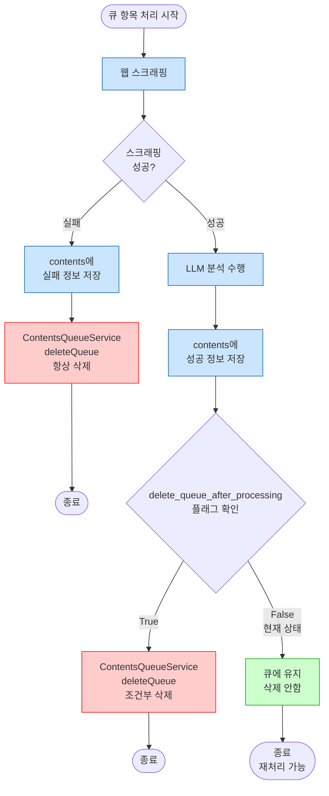

# main_collect_and_scrapping.py 코드 분석 보고서

> 작성일: 2025-12-22  
> 분석 대상: `src/docker_shell/main_collect_and_scrapping.py`

---

## 📋 목차

1. [파일 개요](#1-파일-개요)
2. [Import된 라이브러리 및 패키지](#2-import된-라이브러리-및-패키지)
3. [실행 흐름 분석](#3-실행-흐름-분석)
4. [주요 클래스 및 메서드 상세 분석](#4-주요-클래스-및-메서드-상세-분석)
5. [주석처리된 기능 분석](#5-주석처리된-기능-분석)
6. [데이터 흐름](#6-데이터-흐름)

---

## 1. 파일 개요

### 1.1 파일의 역할

`main_collect_and_scrapping.py`는 **전체 파이프라인의 진입점(Entry Point)**입니다.

**주요 기능**:
1. `contents_queue` 컬렉션에 저장된 기사 URL을 읽어서
2. 웹 스크래핑을 수행하고
3. LLM(Ollama)으로 요약, 키워드 추출, 감성 분석을 수행하며
4. 최종적으로 통계를 계산합니다

### 1.2 실행 모드

**두 가지 실행 모드**:
- **일반 모드**: 전체 파이프라인 실행 (collect + scrape + statistics)
- **`--today-json` 모드**: `today.json` 파일에서 URL을 읽어서 처리

---

## 2. Import된 라이브러리 및 패키지

### 2.1 표준 라이브러리

```python
from datetime import datetime, timedelta  # 날짜/시간 처리
import sys  # 시스템 인자 처리 (--today-json 플래그)
```

### 2.2 커스텀 모듈

#### A. 수집(Collect) 관련
```python
from docker_collect.collect_v2 import DockerCollectMain
```
- **역할**: 정부기관/공공기관 웹사이트에서 공고/뉴스/입찰정보 등을 수집
- **주요 메서드**: `distribute()`
- **결과**: `contents_queue` 컬렉션에 URL 저장

#### B. 스크래핑(Scraping) 관련
```python
from docker_scraping.contents_scraping_ollama_trafilaura import ContentsScrapingOllamaTrafilaura
```
- **역할**: `contents_queue`에서 URL을 읽어서 본문 스크래핑 및 LLM 분석
- **주요 메서드**: 
  - `crawl_and_analyze_ollama()`: 일반 모드
  - `process_articles_from_today_json()`: today.json 모드

#### C. Ollama 관리
```python
from ksubscribe_server.analysis.ollama_alive import OllamaAlive
```
- **역할**: Ollama 서비스가 살아있는지 주기적으로 체크하는 백그라운드 스레드
- **주요 메서드**:
  - `start_thread()`: 체크 스레드 시작
  - `stop_thread()`: 체크 스레드 종료

#### D. 데이터베이스 서비스
```python
from ksubscribe_share.db.service.contentsQueueService import ContentsQueueService
from ksubscribe_share.db.service.contentsService import ContentsService
from ksubscribe_share.db.service.statsService import StatsService
from ksubscribe_share.db.service.contentsOrgService import ContentsOrgService
from ksubscribe_share.db.service.calendarService import CalendarService
```

#### E. 로깅
```python
from ksubscribe_share.logger import Logger
```

#### F. 설정
```python
import ksubscribe_share.config as Conf
```

---

## 3. 실행 흐름 분석

### 3.1 실행 모드 분기

```python
process_today_json_only = len(sys.argv) > 1 and sys.argv[1] == "--today-json"
```

**분기 로직**:
- `--today-json` 플래그가 있으면 → `today.json` 모드
- 없으면 → 일반 모드 (전체 파이프라인)

### 3.2 모드 1: `--today-json` 모드

```python
if process_today_json_only:
    logger = Logger().setup_logger(Logger.docker_scraping_result_logger_name)
    logger.info("=== Processing URLs from today.json only ===")
    try:
        # 1. Ollama Alive 체크 스레드 시작
        checker = OllamaAlive(op_mode="docker_server", keep_alive=False)
        checker.start_thread()
        
        # 2. today.json에서 URL 읽어서 처리
        contentsScrapingOllamaTrafilaura = ContentsScrapingOllamaTrafilaura()
        contentsScrapingOllamaTrafilaura.process_articles_from_today_json()
        
        # 3. 스레드 종료
        checker.stop_thread()
        logger.info("=== Processing complete ===")
    except Exception as e:
        logger.error(f"Error processing today.json: {e}")
        if 'checker' in locals():
            checker.stop_thread()
```

**처리 과정**:
1. `OllamaAlive` 스레드 시작 (Ollama 서비스 상태 모니터링)
2. `process_articles_from_today_json()` 호출
   - `/app/today.json` 파일에서 기사 정보 읽기
   - 각 기사에 대해 스크래핑 및 LLM 분석 수행
   - 결과를 `contents_backup` 컬렉션에 저장
3. 스레드 종료

### 3.3 모드 2: 일반 모드 (전체 파이프라인)

#### Step 1: 수집 단계 (주석처리됨)

```python
# try:
#     # 1. docker collect
#     dockerCollectMain = DockerCollectMain()
#     logger.info("dockerCollectMain.distribute()")
#     dockerCollectMain.distribute()
#     
# except Exception as e:
#     pass 
```

**역할** (현재 비활성화):
- `DockerCollectMain.distribute()` 호출
- 각 기관별, 카테고리별로 웹사이트에서 기사 URL 수집
- 수집된 URL을 `contents_queue` 컬렉션에 저장

**주석처리 이유**: 
- cron job으로 별도 실행 중일 가능성
- 또는 수동으로 수집 작업을 분리한 것으로 보임

#### Step 2: 중복 제거 (주석처리됨)

```python
# try:
#     #Queue의 중복성 검사   
#     ContentsQueueService().removeDuplicateUrl() 
# except Exception as e:
#     pass 
```

**역할** (현재 비활성화):
- `contents_queue` 컬렉션에서 URL 중복 제거
- MongoDB aggregation pipeline 사용
- 같은 URL이 여러 개 있으면 첫 번째만 남기고 나머지 삭제

**주석처리 이유**:
- cron job에서 이미 처리하고 있을 가능성
- 또는 성능 최적화를 위해 비활성화

#### Step 3: 스크래핑 및 분석 (1차)

```python
try:
    # 2. start ollama alive thread
    checker = OllamaAlive(op_mode="docker_server", keep_alive=False)
    checker.start_thread()    
    
    # 3. docker scrapping
    contentsScrapingOllamaTrafilaura = ContentsScrapingOllamaTrafilaura()
    logger.info("contentsScrapingOllamaTrafilaura.crawl_and_analyze_ollama()")
    contentsScrapingOllamaTrafilaura.crawl_and_analyze_ollama()
except Exception as e:
    logger.error(f"error : {e}")
```

**처리 과정**:
1. `OllamaAlive` 스레드 시작
2. `crawl_and_analyze_ollama()` 호출
   - `ContentsQueueService.find_all()`로 `contents_queue`의 모든 항목 조회
   - 각 항목에 대해:
     - 웹 스크래핑 (본문 추출)
     - LLM 분석 (요약, 키워드, 감성 분석)
     - `contents` 컬렉션에 저장
   - **중요**: `self.delete_queue_after_processing = False`이므로 큐에서 삭제하지 않음

#### Step 4: 중복 제거 (주석처리됨)

```python
# try:
#     #contents의 중복성 검사 
#     logger = Logger().setup_logger(Logger.docker_scraping_result_logger_name)    
#     ContentsService().removeDuplicateUrl(logger)
#     pass 
# except Exception as e:
#     pass  
```

**역할** (현재 비활성화):
- `contents` 컬렉션에서 URL 중복 제거
- 같은 URL이 여러 개 있으면 첫 번째만 남기고 나머지 삭제

**주석처리 이유**:
- LLM 작업 후 정리 작업으로 보임
- 현재는 비활성화 상태

#### Step 5: 스크래핑 및 분석 (2차 - 재처리)

```python
try:
    #7시간전 ~ 지금 까지의 contents 중 ollama 요약 안된 데이터 다시 요약(collectDT 기준)
    logger.info("contentsScrapingOllamaTrafilaura.crawl_and_analyze_ollama() - second time....")
    contentsScrapingOllamaTrafilaura = ContentsScrapingOllamaTrafilaura()
    end_date = datetime.utcnow()
    start_date = end_date - timedelta(hours=7)

    #코드 재개발 필요함 
    contentsScrapingOllamaTrafilaura.crawl_and_analyze_ollama()#(start_date=start_date,end_date=end_date,is_all=False)
except Exception as e:
    logger.error(f"Second scraping error: {str(e)}")
```

**역할**:
- 실패한 항목을 재처리하기 위한 2차 실행
- **문제점**: 현재는 전체 큐를 다시 처리함 (주석에 "코드 재개발 필요함" 표기)
- `start_date`, `end_date` 파라미터가 주석처리되어 있어 실제로는 전체 큐를 다시 처리

**주의사항**:
- `delete_queue_after_processing = False`이므로 큐에 남아있는 항목들이 재처리됨
- 중복 저장 및 불필요한 LLM 호출 발생 가능

#### Step 6: 통계 계산

```python
try:
    # 4. Calculate statistics for all organizations
    logger = Logger().setup_logger(Logger.docker_scraping_result_logger_name)
    logger.info("=== Calculating statistics ===")
    
    stats_service = StatsService()
    calendar_service = CalendarService()
    contents_org_service = ContentsOrgService()
    
    # Get all organizations
    orgs = contents_org_service.find_all()
    logger.info(f"Found {len(orgs)} organizations")
    
    for org in orgs:
        try:
            org_id = org.orgId
            logger.info(f"Processing statistics for {org_id}...")
            
            # Calculate statistics for each period
            for period in ['day', 'week', 'month']:
                try:
                    # Calculate main statistics
                    stats = stats_service.count_for_period(org_id, period)
                    logger.info(f"  - {period}: {stats._id}")
                    
                    # Calculate calendar results
                    calendar_results = calendar_service.get_calendar_results(org_id)
                    logger.info(f"  - calendar: {len(calendar_results['positiveResult'])} days")
                    
                except Exception as e:
                    logger.error(f"  - {period}: Error - {str(e)}")
                    
        except Exception as e:
            logger.error(f"Error processing {org.orgId}: {str(e)}")
    
    logger.info("=== Statistics calculation complete ===")
    
except Exception as e:
    logger.error(f"Error in statistics calculation: {str(e)}")

checker.stop_thread()
```

**처리 과정**:
1. 모든 기관 조회 (`ContentsOrgService.find_all()`)
2. 각 기관별로:
   - 일별/주별/월별 통계 계산 (`StatsService.count_for_period()`)
   - 캘린더 결과 계산 (`CalendarService.get_calendar_results()`)
3. `OllamaAlive` 스레드 종료

---

## 4. 주요 클래스 및 메서드 상세 분석

### 4.1 DockerCollectMain

**파일**: `docker_collect/collect_v2.py`

**역할**: 기관별 웹사이트에서 기사 URL 수집

**주요 메서드**:
- `distribute()`: 수집 메인 로직
  - 모든 기관 및 카테고리 조회
  - 수집 방법에 따라 분기:
    - `C0003` (SELENIUM): 동적 웹페이지 크롤링
    - `C0001` (RSS): RSS 피드 파싱
    - 기타 (OPEN API): 나라장터 API, 네이버 뉴스 API 등
  - 수집된 URL을 `ContentsQueueService.insertQueue()`로 저장

**결과**: `contents_queue` 컬렉션에 URL 저장

### 4.2 ContentsScrapingOllamaTrafilaura

**파일**: `docker_scraping/contents_scraping_ollama_trafilaura.py`

**역할**: `contents_queue`에서 URL을 읽어서 스크래핑 및 LLM 분석

#### A. `crawl_and_analyze_ollama()`

**처리 과정**:
1. `ContentsQueueService.find_all()`로 모든 큐 항목 조회
2. 각 항목에 대해 `crawl_and_analyze_one_ollama()` 호출
3. 성공/실패 개수 로깅

**중요 설정**:
- `self.delete_queue_after_processing = False` (초기화 시 설정)
- 따라서 처리 후에도 큐에서 삭제하지 않음

#### B. `crawl_and_analyze_one_ollama()`

**처리 과정**:
1. **기관/카테고리 유효성 검사**
2. **웹 스크래핑**:
   - 카테고리 ID가 "B0010"이면: `TrafilauraScraper.get_newbody()` 사용
   - 그 외: `collectMethod`에 따라 분기
     - `ONLYPDF`: PDF만 추출
     - `TEXTINTAG`: Trafilaura 사용
     - `TEXTINBODY`: WebLoaderV3 사용
3. **스크래핑 실패 시**:
   - `contents` 컬렉션에 실패 정보 저장
   - **큐에서 삭제**: `ContentsQueueService().deleteQueue(queueContent._id)`
4. **스크래핑 성공 시**:
   - **LLM 분석**: `AnalysisOllamaGenerateCall.analysis_main()` 호출
     - 요약 (`short_summary`, `short_summary2`, `long_summary`)
     - 키워드 추출 (`predKeywords`, `predKeywords2`)
     - 감성 분석 (`positiveRatio`, `negativeRatio`, `neutralRatio`, `positiveKeywords`, `negativeKeywords`, `neutralKeywords`)
   - `contents` 컬렉션에 저장
   - **큐 삭제 조건부**: `if self.delete_queue_after_processing: ContentsQueueService().deleteQueue(queueContent._id)`
     - 현재는 `False`이므로 삭제하지 않음

#### C. `process_articles_from_today_json()`

**처리 과정**:
1. `/app/today.json` 파일에서 기사 정보 읽기
2. 각 기사에 대해:
   - `ContentsQueueVO` 객체 생성
   - `process_single_article_to_backup()` 호출
   - 결과를 `contents_backup` 컬렉션에 저장

### 4.3 OllamaAlive

**파일**: `ksubscribe_server/analysis/ollama_alive.py`

**역할**: Ollama 서비스 상태 모니터링

**주요 메서드**:
- `start_thread()`: 백그라운드 스레드 시작
- `stop_thread()`: 백그라운드 스레드 종료

**동작 방식**:
- 1초마다 `{OLLAMA_URL}/api/ps` 엔드포인트에 요청
- 5회 연속 실패 시 텔레그램으로 알림 전송 (docker_server 모드)
- `op_mode="docker_server"`일 때는 재시작하지 않고 알림만 전송

### 4.4 ContentsQueueService

**파일**: `ksubscribe_share/db/service/contentsQueueService.py`

**주요 메서드**:
- `find_all()`: `contents_queue` 컬렉션의 모든 항목 조회
- `removeDuplicateUrl()`: URL 중복 제거 (MongoDB aggregation 사용)
- `deleteQueue(_id)`: 특정 항목 삭제

### 4.5 ContentsService

**파일**: `ksubscribe_share/db/service/contentsService.py`

**주요 메서드**:
- `removeDuplicateUrl(logger)`: `contents` 컬렉션에서 URL 중복 제거
- `isExistContents(url)`: URL이 이미 존재하는지 확인 (현재 주석처리됨)

### 4.6 StatsService

**파일**: `ksubscribe_share/db/service/statsService.py`

**주요 메서드**:
- `count_for_period(orgId, period)`: 기관별 일별/주별/월별 통계 계산
  - `period`: 'day', 'week', 'month'
  - `contents` 컬렉션에서 해당 기간의 데이터 조회
  - 긍정/부정/중립 비율, 키워드 등 집계
  - 통계 객체 생성 및 저장

### 4.7 CalendarService

**파일**: `ksubscribe_share/db/service/calendarService.py`

**주요 메서드**:
- `get_calendar_results(orgId)`: 기관별 캘린더 결과 계산
  - 긍정/부정/중립 기사가 있는 날짜 목록 반환
  - `positiveResult`, `negativeResult`, `neutralResult` 딕셔너리 반환

---

## 5. 주석처리된 기능 분석

### 5.1 Step 1: Docker Collect (주석처리됨)

**코드 위치**: Lines 48-55

```python
# try:
#     # 1. docker collect
#     dockerCollectMain = DockerCollectMain()
#     logger.info("dockerCollectMain.distribute()")
#     dockerCollectMain.distribute()
#     
# except Exception as e:
#     pass 
```

**기능**:
- `DockerCollectMain.distribute()` 호출
- 각 기관별, 카테고리별로 웹사이트에서 기사 URL 수집
- 수집된 URL을 `contents_queue` 컬렉션에 저장

**주석처리 이유 추정**:
- cron job으로 별도 실행 중
- 수집 작업을 수동으로 분리

**영향**:
- `contents_queue`는 cron job이나 다른 스크립트에서 채워져야 함

### 5.2 Step 2: Queue 중복 제거 (주석처리됨)

**코드 위치**: Lines 57-61

```python
# try:
#     #Queue의 중복성 검사   
#     ContentsQueueService().removeDuplicateUrl() 
# except Exception as e:
#     pass 
```

**기능**:
- `contents_queue` 컬렉션에서 URL 중복 제거
- MongoDB aggregation pipeline 사용:
  ```python
  pipeline = [
      {
          "$group": {
              "_id": "$url",
              "count": {"$sum": 1},
              "docs": {"$push": "$_id"}
          }
      },
      {
          "$match": {
              "count": {"$gt": 1}
          }
      }
  ]
  ```
- 같은 URL이 여러 개 있으면 첫 번째만 남기고 나머지 삭제

**주석처리 이유 추정**:
- cron job에서 이미 처리
- 또는 성능 최적화를 위해 비활성화

**영향**:
- 중복 URL이 큐에 남아있을 수 있음
- 하지만 `crawl_and_analyze_one_ollama()` 내부에서 `ContentsService().isExistContents()` 체크가 주석처리되어 있어 중복 처리 가능

### 5.3 Step 4: Contents 중복 제거 (주석처리됨)

**코드 위치**: Lines 74-80

```python
# try:
#     #contents의 중복성 검사 
#     logger = Logger().setup_logger(Logger.docker_scraping_result_logger_name)    
#     ContentsService().removeDuplicateUrl(logger)
#     pass 
# except Exception as e:
#     pass  
```

**기능**:
- `contents` 컬렉션에서 URL 중복 제거
- LLM 작업 완료 후 정리 작업

**주석처리 이유 추정**:
- 성능 최적화
- 또는 별도 스크립트로 실행

**영향**:
- `contents` 컬렉션에 중복 데이터가 쌓일 수 있음

---

## 6. 데이터 흐름

### 6.1 전체 실행 흐름도 (주석처리된 부분 포함)

```mermaid
flowchart TD
    Start([main_collect_and_scrapping.py<br/>실행 시작]) --> CheckMode{실행 모드<br/>확인}
    
    CheckMode -->|--today-json| TodayJsonMode[today.json 모드]
    CheckMode -->|일반 모드| NormalMode[일반 모드]
    
    %% Today.json 모드
    TodayJsonMode --> StartOllama1[OllamaAlive.start_thread<br/>백그라운드 모니터링 시작]
    StartOllama1 --> ProcessTodayJson[process_articles_from_today_json<br/>today.json 파일 읽기]
    ProcessTodayJson --> ScrapeToday[각 기사 스크래핑 및 LLM 분석]
    ScrapeToday --> SaveBackup[contents_backup 컬렉션에 저장]
    SaveBackup --> StopOllama1[OllamaAlive.stop_thread]
    StopOllama1 --> End1([종료])
    
    %% 일반 모드 - Step 1: 수집 (주석처리됨)
    NormalMode --> Step1[Step 1: Docker Collect<br/>주석처리됨]
    Step1 --> CollectMain[DockerCollectMain.distribute<br/>기관별 웹사이트 크롤링]
    CollectMain --> CollectMethods{수집 방법 분기}
    CollectMethods -->|C0003| Selenium[SELENIUM<br/>동적 웹페이지]
    CollectMethods -->|C0001| RSS[RSS 피드 파싱]
    CollectMethods -->|기타| OpenAPI[OPEN API<br/>나라장터/네이버뉴스]
    Selenium --> InsertQueue1[ContentsQueueService.insertQueue<br/>contents_queue에 URL 저장]
    RSS --> InsertQueue1
    OpenAPI --> InsertQueue1
    
    %% Step 2: 큐 중복 제거 (주석처리됨)
    InsertQueue1 --> Step2[Step 2: Queue 중복 제거<br/>주석처리됨]
    Step2 --> RemoveDupQueue[ContentsQueueService.removeDuplicateUrl<br/>MongoDB Aggregation으로 중복 URL 제거]
    RemoveDupQueue --> Step3[Step 3: 스크래핑 및 분석 1차]
    
    %% Step 3: 스크래핑 및 분석 1차
    Step3 --> StartOllama2[OllamaAlive.start_thread<br/>백그라운드 모니터링 시작]
    StartOllama2 --> CrawlAnalyze1[ContentsScrapingOllamaTrafilaura<br/>crawl_and_analyze_ollama]
    CrawlAnalyze1 --> FindAllQueue[ContentsQueueService.find_all<br/>contents_queue의 모든 항목 조회]
    
    FindAllQueue --> Loop1{각 큐 항목에 대해}
    Loop1 --> ValidateOrg[기관/카테고리<br/>유효성 검사]
    ValidateOrg -->|유효| ScrapeMethod{스크래핑 방법}
    ValidateOrg -->|무효| Skip1[건너뛰기]
    
    ScrapeMethod -->|B0010| Trafilaura1[TrafilauraScraper<br/>get_newbody]
    ScrapeMethod -->|ONLYPDF| PDF1[WebLoaderV3<br/>PDF 추출]
    ScrapeMethod -->|TEXTINTAG| Trafilaura2[TrafilauraScraper<br/>get_newbody]
    ScrapeMethod -->|TEXTINBODY| WebLoader1[WebLoaderV3<br/>본문 추출]
    
    Trafilaura1 --> CheckScrape1{스크래핑<br/>성공?}
    PDF1 --> CheckScrape1
    Trafilaura2 --> CheckScrape1
    WebLoader1 --> CheckScrape1
    
    CheckScrape1 -->|실패| SaveFail[contents 컬렉션에<br/>실패 정보 저장]
    SaveFail --> DeleteQueue1[ContentsQueueService.deleteQueue<br/>큐에서 삭제]
    DeleteQueue1 --> NextItem1[다음 항목]
    
    CheckScrape1 -->|성공| LLMAnalysis1[AnalysisOllamaGenerateCall<br/>analysis_main]
    LLMAnalysis1 --> LLMProcess1[LLM 분석 수행]
    LLMProcess1 --> LLMResults1[요약/키워드/감성 분석<br/>결과 생성]
    LLMResults1 --> SaveContents1[ContentsService.insert_one<br/>contents 컬렉션에 저장]
    SaveContents1 --> CheckDelete1{delete_queue_after_processing?}
    CheckDelete1 -->|True| DeleteQueue2[ContentsQueueService.deleteQueue]
    CheckDelete1 -->|False 현재| KeepQueue1[큐에 유지]
    DeleteQueue2 --> NextItem1
    KeepQueue1 --> NextItem1
    Skip1 --> NextItem1
    
    NextItem1 --> Loop1
    Loop1 -->|모든 항목 처리 완료| Step4[Step 4: Contents 중복 제거<br/>주석처리됨]
    
    %% Step 4: Contents 중복 제거 (주석처리됨)
    Step4 --> RemoveDupContents[ContentsService.removeDuplicateUrl<br/>contents 컬렉션에서 중복 URL 제거]
    RemoveDupContents --> Step5[Step 5: 스크래핑 및 분석 2차]
    
    %% Step 5: 스크래핑 및 분석 2차 (재처리)
    Step5 --> CrawlAnalyze2[ContentsScrapingOllamaTrafilaura<br/>crawl_and_analyze_ollama<br/>2차 실행]
    CrawlAnalyze2 --> FindAllQueue2[ContentsQueueService.find_all<br/>전체 큐 다시 조회<br/>문제: 실패 항목만 필터링 안됨]
    FindAllQueue2 --> Loop2{각 큐 항목에 대해<br/>재처리}
    Loop2 --> ValidateOrg2[기관/카테고리 검사]
    ValidateOrg2 --> ScrapeMethod2{스크래핑 방법}
    ScrapeMethod2 --> Trafilaura3[TrafilauraScraper]
    ScrapeMethod2 --> WebLoader2[WebLoaderV3]
    Trafilaura3 --> CheckScrape2{스크래핑 성공?}
    WebLoader2 --> CheckScrape2
    CheckScrape2 -->|실패| SaveFail2[실패 정보 저장]
    CheckScrape2 -->|성공| LLMAnalysis2[LLM 분석]
    LLMAnalysis2 --> SaveContents2[contents 저장]
    SaveFail2 --> NextItem2[다음 항목]
    SaveContents2 --> NextItem2
    NextItem2 --> Loop2
    Loop2 -->|모든 항목 처리 완료| Step6[Step 6: 통계 계산]
    
    %% Step 6: 통계 계산
    Step6 --> GetOrgs[ContentsOrgService.find_all<br/>모든 기관 조회]
    GetOrgs --> LoopOrg{각 기관에 대해}
    LoopOrg --> LoopPeriod{각 기간에 대해<br/>day/week/month}
    LoopPeriod --> CalcStats[StatsService.count_for_period<br/>일별/주별/월별 통계 계산]
    CalcStats --> ReadContents[contents 컬렉션에서<br/>해당 기간 데이터 조회]
    ReadContents --> Aggregate[긍정/부정/중립 비율<br/>키워드 집계]
    Aggregate --> SaveStats[stats 컬렉션에<br/>통계 저장]
    SaveStats --> CalcCalendar[CalendarService.get_calendar_results<br/>캘린더 결과 계산]
    CalcCalendar --> SaveCalendar[calendar 컬렉션에<br/>결과 저장]
    SaveCalendar --> NextPeriod[다음 기간]
    NextPeriod --> LoopPeriod
    LoopPeriod -->|모든 기간 완료| NextOrg[다음 기관]
    NextOrg --> LoopOrg
    LoopOrg -->|모든 기관 완료| StopOllama2[OllamaAlive.stop_thread]
    StopOllama2 --> End2([종료])
    
    %% 스타일링
    classDef commented fill:#ffcccc,stroke:#ff0000,stroke-width:2px,stroke-dasharray: 5 5
    classDef active fill:#ccffcc,stroke:#00aa00,stroke-width:2px
    classDef process fill:#cce5ff,stroke:#0066cc,stroke-width:2px
    classDef database fill:#fff4cc,stroke:#cc9900,stroke-width:2px
    classDef decision fill:#e6ccff,stroke:#6600cc,stroke-width:2px
    
    class Step1,CollectMain,Step2,RemoveDupQueue,Step4,RemoveDupContents commented
    class Step3,StartOllama2,CrawlAnalyze1,Step5,CrawlAnalyze2,Step6,GetOrgs active
    class LLMAnalysis1,LLMAnalysis2,ScrapeMethod,ScrapeMethod2 process
    class InsertQueue1,SaveContents1,SaveContents2,SaveStats,SaveCalendar,SaveBackup database
    class CheckMode,CheckScrape1,CheckScrape2,CheckDelete1,Loop1,Loop2,LoopOrg,LoopPeriod,CollectMethods decision
```



### 6.2 데이터 흐름 상세도

```mermaid
flowchart LR
    subgraph External["외부 데이터 소스"]
        WebSites[기관 웹사이트<br/>RSS 피드<br/>Open API]
        TodayJson[/app/today.json<br/>파일]
    end
    
    subgraph MongoDB["MongoDB 컬렉션"]
        Queue[(contents_queue<br/>URL 목록)]
        Contents[(contents<br/>스크래핑 및 분석 결과)]
        Backup[(contents_backup<br/>백업 데이터)]
        Stats[(stats<br/>통계 데이터)]
        Calendar[(calendar<br/>캘린더 결과)]
        Org[(contents_org<br/>기관 정보)]
    end
    
    subgraph Processing["처리 단계"]
        Collect[DockerCollectMain<br/>수집]
        Scrape[ContentsScrapingOllamaTrafilaura<br/>스크래핑]
        LLM[AnalysisOllamaGenerateCall<br/>LLM 분석]
        StatsCalc[StatsService<br/>통계 계산]
    end
    
    subgraph Ollama["Ollama 서비스"]
        OllamaAPI[Ollama API<br/>요약/키워드/감성 분석]
        OllamaMonitor[OllamaAlive<br/>상태 모니터링]
    end
    
    %% 데이터 흐름
    WebSites -->|URL 수집| Collect
    Collect -->|URL 저장| Queue
    TodayJson -->|기사 정보 읽기| Scrape
    
    Queue -->|URL 조회| Scrape
    Scrape -->|본문 추출| LLM
    LLM -->|API 호출| OllamaAPI
    OllamaAPI -->|분석 결과| LLM
    LLM -->|결과 저장| Contents
    Scrape -->|백업 저장| Backup
    
    Contents -->|데이터 조회| StatsCalc
    Org -->|기관 정보| StatsCalc
    StatsCalc -->|통계 저장| Stats
    StatsCalc -->|캘린더 저장| Calendar
    
    OllamaMonitor -.->|상태 체크| OllamaAPI
    
    %% 스타일링
    classDef external fill:#ffe6e6,stroke:#cc0000
    classDef mongo fill:#e6f3ff,stroke:#0066cc
    classDef process fill:#e6ffe6,stroke:#00cc00
    classDef ollama fill:#fff0e6,stroke:#ff6600
    
    class WebSites,TodayJson external
    class Queue,Contents,Backup,Stats,Calendar,Org mongo
    class Collect,Scrape,LLM,StatsCalc process
    class OllamaAPI,OllamaMonitor ollama
```

### 6.3 큐 삭제 로직 상세도



### 6.2 큐 삭제 로직

**현재 상태**:
- `self.delete_queue_after_processing = False` (초기화 시 설정)
- 따라서 처리 후에도 큐에서 삭제하지 않음

**예외 케이스**:
- 스크래핑 실패 시: `ContentsQueueService().deleteQueue(queueContent._id)` 호출 (Line 367)
- 성공 시: 삭제하지 않음 (Line 438-439는 조건부로만 실행)

**문제점**:
- 큐에 항목이 계속 남아있어 2차 실행 시 재처리됨
- 중복 저장 및 불필요한 LLM 호출 발생

### 6.3 중복 체크 로직

**현재 상태**:
- `ContentsService().isExistContents(queueContent.url)` 체크가 주석처리됨 (Line 316-318)
- 따라서 이미 처리된 URL도 다시 처리됨

**영향**:
- 같은 URL이 여러 번 처리되어 `contents` 컬렉션에 중복 저장 가능

---

## 7. 주요 발견 사항

### 7.1 큐 삭제 미구현

**문제**:
- `delete_queue_after_processing = False`로 설정되어 있음
- 처리 후에도 큐에서 삭제하지 않아 재처리 발생

**해결 방안**:
- `self.delete_queue_after_processing = True`로 변경
- 또는 성공 시 명시적으로 `ContentsQueueService().deleteQueue()` 호출

### 7.2 중복 체크 비활성화

**문제**:
- `ContentsService().isExistContents()` 체크가 주석처리됨
- 이미 처리된 URL도 다시 처리됨

**해결 방안**:
- 주석 해제하여 중복 체크 활성화
- 또는 `contents` 컬렉션에 unique index 설정

### 7.3 2차 실행 로직 미완성

**문제**:
- 2차 실행 시 `start_date`, `end_date` 파라미터가 주석처리됨
- 전체 큐를 다시 처리하여 중복 발생

**해결 방안**:
- 실패한 항목만 필터링하는 로직 구현
- 또는 `scrapping_for_exist_contents()` 메서드 활용

---

## 8. 결론

### 8.1 현재 동작 방식

1. **수집 단계**: cron job 또는 별도 스크립트로 실행 (주석처리됨)
2. **스크래핑 및 분석**: `crawl_and_analyze_ollama()` 호출
   - 큐의 모든 항목 처리
   - 처리 후에도 큐에서 삭제하지 않음
3. **2차 실행**: 전체 큐를 다시 처리 (문제점)
4. **통계 계산**: 모든 기관별 통계 계산

### 8.2 개선 권장 사항

1. **큐 삭제 활성화**: `delete_queue_after_processing = True`로 변경
2. **중복 체크 활성화**: `isExistContents()` 체크 주석 해제
3. **2차 실행 로직 개선**: 실패한 항목만 재처리하도록 수정
4. **중복 제거 활성화**: 주석처리된 중복 제거 로직 활성화 검토

---

## 9. 참고 파일

- `docker_collect/collect_v2.py`: 수집 로직
- `docker_scraping/contents_scraping_ollama_trafilaura.py`: 스크래핑 및 분석 로직
- `ksubscribe_server/analysis/ollama_alive.py`: Ollama 상태 모니터링
- `ksubscribe_share/db/service/contentsQueueService.py`: 큐 관리
- `ksubscribe_share/db/service/contentsService.py`: 컨텐츠 관리
- `ksubscribe_share/db/service/statsService.py`: 통계 계산
- `ksubscribe_share/db/service/calendarService.py`: 캘린더 결과 계산

