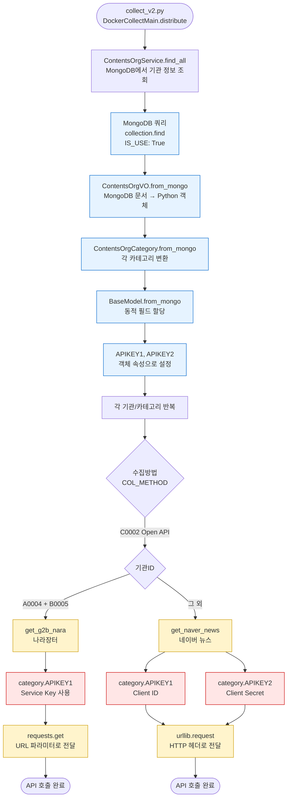
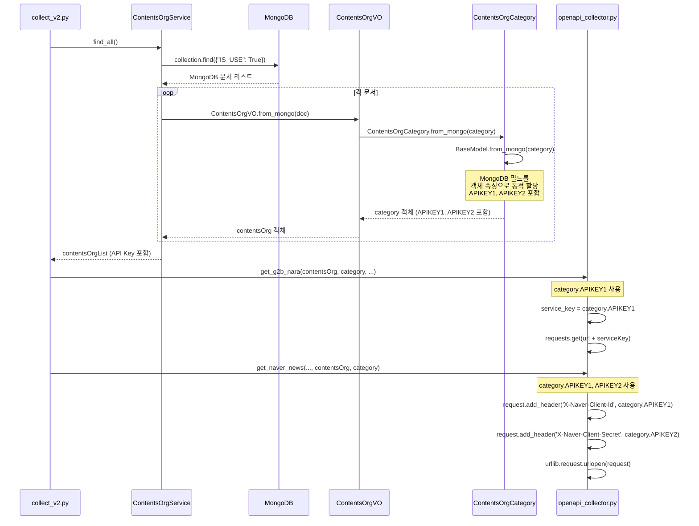

# OpenAPI Collector API Key 호출 및 저장 경로 분석

> 작성일: 2025-12-23  
> 분석 대상: `src/docker_collect/openapi_collector.py`

---

## 📋 목차

1. [API Key 호출 방식 분석](#1-api-key-호출-방식-분석)
2. [데이터 흐름도](#2-데이터-흐름도)
3. [최종 저장 경로 확인](#3-최종-저장-경로-확인)
4. [요약](#4-요약)

---

## 1. API Key 호출 방식 분석

### 1.1 나라장터 API Key 호출

**위치**: `openapi_collector.py` Line 59

```python
def get_g2b_nara(contentsOrg : ContentsOrgVO, category : ContentsOrgCategory, g2b_keywords: List[str]):
    # ... 생략 ...
    service_key = category.APIKEY1  # Line 59: 나라장터 Service Key 가져오기
    url = None
    for date in date_list:
        for key_word in g2b_keywords:
            # Line 71: URL에 serviceKey 파라미터로 추가
            url = f'{category.collectUrlInfo}&serviceKey={service_key}&inqryBgnDt={date}0000&inqryEndDt={date}2359&bidNtceNm={key_word}'
            # Line 79: requests.get()으로 API 호출
            response = requests.get(url, verify=False)
```

**호출 흐름**:
1. `category.APIKEY1`에서 Service Key 가져오기
2. URL 쿼리 파라미터로 `serviceKey` 추가
3. `requests.get()`으로 나라장터 API 호출

**특징**:
- `APIKEY1`만 사용 (나라장터는 Service Key 하나만 필요)
- `APIKEY2`는 사용하지 않음

---

### 1.2 네이버 뉴스 API Key 호출

**위치**: `openapi_collector.py` Line 213-214

```python
def get_naver_news(providerOrgId:str, contentsOrg : ContentsOrgVO, category : ContentsOrgCategory):
    # ... 생략 ...
    for idx, key_word in enumerate(naver_key_words):
        query = urllib.parse.quote(key_word)
        url = category.collectUrlInfo + query
        
        request = urllib.request.Request(url)
        # Line 213: Client ID를 HTTP 헤더에 추가
        request.add_header('X-Naver-Client-Id', category.APIKEY1)
        # Line 214: Client Secret을 HTTP 헤더에 추가
        request.add_header('X-Naver-Client-Secret', category.APIKEY2)
        response = urllib.request.urlopen(request)
```

**호출 흐름**:
1. `category.APIKEY1`에서 Client ID 가져오기
2. `category.APIKEY2`에서 Client Secret 가져오기
3. HTTP 헤더에 `X-Naver-Client-Id`와 `X-Naver-Client-Secret` 추가
4. `urllib.request.urlopen()`으로 네이버 API 호출

**특징**:
- `APIKEY1`과 `APIKEY2` 모두 사용
- HTTP 헤더 방식으로 인증 (URL 파라미터 아님)

---

## 2. 데이터 흐름도

### 2.1 전체 데이터 흐름



### 2.2 API Key 로드 상세 흐름



---

## 3. 최종 저장 경로 확인

### 3.1 저장 위치 확인 결과

#### ✅ MongoDB에 저장됨

**저장 위치**: MongoDB `contents_org` 컬렉션

**데이터 구조**:
```json
{
  "_id": ObjectId("..."),
  "orgId": "A0004",
  "orgName": "나라장터",
  "categoryList": [
    {
      "cateId": "B0005",
      "cateName": "입찰공고",
      "APIKEY1": "efdW9bR%2FAKR6XOI%2FDxQOy7Zj%2Bj15Yu1vIPWlT3EfzwEN77YVUGooPRAx1E%2BaFtGqCxZuFRwKdAhfnHSueXVshw%3D%3D",
      "APIKEY2": null,
      "COL_METHOD": "C0002",
      "collectUrlInfo": "https://apis.data.go.kr/1230000/ad/BidPublicInfoService/getBidPblancListInfoServcPPSSrch?numOfRows=100&pageNo=1&inqryDiv=1&type=json"
    }
  ]
}
```

#### ❌ .env 파일에 저장되지 않음

**확인 결과**: 프로젝트 루트에 `.env` 파일이 존재하지 않음

**검색 결과**:
- `.env` 파일: 없음
- `.env*` 파일: 없음

**결론**: API Key는 `.env` 파일이 아닌 **MongoDB에만 저장**되어 있습니다.

---

### 3.2 API Key 로드 메커니즘

#### Step 1: MongoDB에서 조회

**파일**: `src/ksubscribe_share/db/service/contentsOrgService.py` (Line 71-91)

```python
def find_all(self):
    try: 
        collection = self.mongoManager.getCollection(self.collectionName)  # "contents_org"
        cursor = collection.find({"IS_USE": True})  # 활성화된 기관만 조회
        result_list = [ContentsOrgVO.from_mongo(item) for item in cursor]  # MongoDB 문서 → Python 객체
        return result_list
```

#### Step 2: MongoDB 문서 → Python 객체 변환

**파일**: `src/ksubscribe_share/db/dbmodelV2/contentsOrgVO.py` (Line 148-162)

```python
@classmethod
def from_mongo(cls: Type[T], mongo_data: Dict) -> T:
    instance = super().from_mongo(mongo_data)  # BaseMongoDocument.from_mongo 호출
    
    # categoryList 변환
    instance.categoryList = [
        ContentsOrgCategory.from_mongo(category)  # 각 카테고리 변환
        for category in mongo_data.get("categoryList", [])
    ]
    return instance
```

#### Step 3: 카테고리 객체 생성 (API Key 포함)

**파일**: `src/ksubscribe_share/db/dbmodelV2/baseDocument.py` (Line 20-26)

```python
@classmethod
def from_mongo(cls: Type[T], document: dict) -> T:
    """MongoDB 문서를 클래스로 변환"""
    instance = cls.__new__(cls)  # __init__ 호출 없이 객체 생성
    for key, value in document.items():
        setattr(instance, key, value)  # 동적으로 속성 할당
    return instance
```

**동작 원리**:
- MongoDB 문서의 모든 필드(`APIKEY1`, `APIKEY2` 포함)가 객체 속성으로 자동 할당됨
- `category.APIKEY1`, `category.APIKEY2`로 접근 가능

---

## 4. 요약

### 4.1 API Key 호출 방식

| API | 호출 위치 | 사용 필드 | 전달 방식 |
|-----|----------|----------|----------|
| **나라장터** | `openapi_collector.py` Line 59 | `category.APIKEY1` | URL 쿼리 파라미터 (`serviceKey`) |
| **네이버 뉴스** | `openapi_collector.py` Line 213-214 | `category.APIKEY1`<br/>`category.APIKEY2` | HTTP 헤더<br/>(`X-Naver-Client-Id`<br/>`X-Naver-Client-Secret`) |

### 4.2 최종 저장 경로

| 저장 위치 | 상태 | 경로/컬렉션 |
|----------|------|------------|
| **MongoDB** | ✅ 사용 중 | `contents_org` 컬렉션<br/>`categoryList[].APIKEY1`<br/>`categoryList[].APIKEY2` |
| **.env 파일** | ❌ 없음 | 프로젝트에 `.env` 파일 없음 |
| **config.py** | ❌ 없음 | `config.py`에 API Key 정의 없음 |

### 4.3 데이터 흐름 요약

```
MongoDB (contents_org)
    ↓
ContentsOrgService.find_all()
    ↓
ContentsOrgVO.from_mongo() → ContentsOrgCategory.from_mongo()
    ↓
BaseModel.from_mongo() → 동적 필드 할당 (APIKEY1, APIKEY2 포함)
    ↓
category.APIKEY1, category.APIKEY2
    ↓
openapi_collector.py에서 사용
    ├─ 나라장터: URL 파라미터로 전달
    └─ 네이버: HTTP 헤더로 전달
```

### 4.4 핵심 발견 사항

1. **API Key는 MongoDB에만 저장됨**
   - `.env` 파일 없음
   - `config.py`에 하드코딩 없음
   - MongoDB `contents_org` 컬렉션의 각 카테고리 문서에 저장

2. **동적 로드 메커니즘**
   - `BaseModel.from_mongo()`가 MongoDB 문서의 모든 필드를 객체 속성으로 자동 할당
   - 별도의 매핑 코드 없이 `category.APIKEY1`, `category.APIKEY2`로 접근 가능

3. **API별 사용 방식 차이**
   - **나라장터**: `APIKEY1`만 사용, URL 파라미터로 전달
   - **네이버**: `APIKEY1`, `APIKEY2` 모두 사용, HTTP 헤더로 전달

---

## 5. 참고 코드 위치

### 5.1 API Key 사용 위치

- **나라장터**: `src/docker_collect/openapi_collector.py` Line 59, 71
- **네이버 뉴스**: `src/docker_collect/openapi_collector.py` Line 213-214

### 5.2 데이터 로드 위치

- **서비스 레이어**: `src/ksubscribe_share/db/service/contentsOrgService.py` Line 71-91
- **모델 레이어**: `src/ksubscribe_share/db/dbmodelV2/contentsOrgVO.py` Line 148-162
- **베이스 클래스**: `src/ksubscribe_share/db/dbmodelV2/baseDocument.py` Line 20-26

### 5.3 호출 위치

- **메인 진입점**: `src/docker_collect/collect_v2.py` Line 69, 110, 114

---

## 6. MongoDB에서 API Key 확인 방법

### 6.1 MongoDB 쿼리 예시

```javascript
// 나라장터 API Key 확인
db.contents_org.findOne(
  { "orgId": "A0004", "categoryList.cateId": "B0005" },
  { "orgName": 1, "categoryList.$": 1 }
)

// 네이버 뉴스 API Key 확인
db.contents_org.findOne(
  { "categoryList.cateId": "B0010" },
  { "orgName": 1, "orgId": 1, "categoryList.$": 1 }
)
```

### 6.2 Python 스크립트로 확인

```python
from ksubscribe_share.db.service.contentsOrgService import ContentsOrgService

service = ContentsOrgService()
orgs = service.find_all()

# 나라장터
for org in orgs:
    if org.orgId == "A0004":
        for category in org.categoryList:
            if category.cateId == "B0005":
                print(f"나라장터 APIKEY1: {category.APIKEY1}")

# 네이버 뉴스
for org in orgs:
    for category in org.categoryList:
        if category.cateId == "B0010":
            print(f"{org.orgName} - APIKEY1: {category.APIKEY1}, APIKEY2: {category.APIKEY2}")
```

---

## 7. 결론

### ✅ 최종 답변

**API Key 저장 위치**: **MongoDB `contents_org` 컬렉션**

- `.env` 파일: ❌ 없음
- `config.py`: ❌ API Key 정의 없음
- MongoDB: ✅ `contents_org.categoryList[].APIKEY1`, `APIKEY2`에 저장

**API Key 호출 방식**:
1. `ContentsOrgService.find_all()`로 MongoDB에서 기관 정보 조회
2. `ContentsOrgVO.from_mongo()` → `ContentsOrgCategory.from_mongo()`로 변환
3. `BaseModel.from_mongo()`가 MongoDB 필드를 객체 속성으로 자동 할당
4. `category.APIKEY1`, `category.APIKEY2`로 접근
5. 나라장터는 URL 파라미터로, 네이버는 HTTP 헤더로 전달


