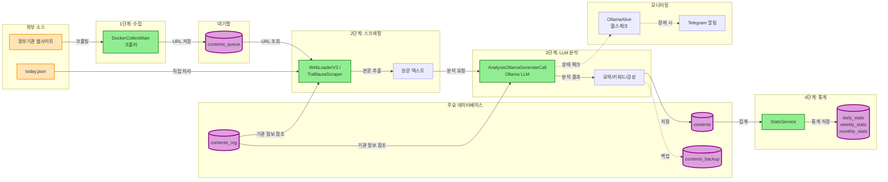
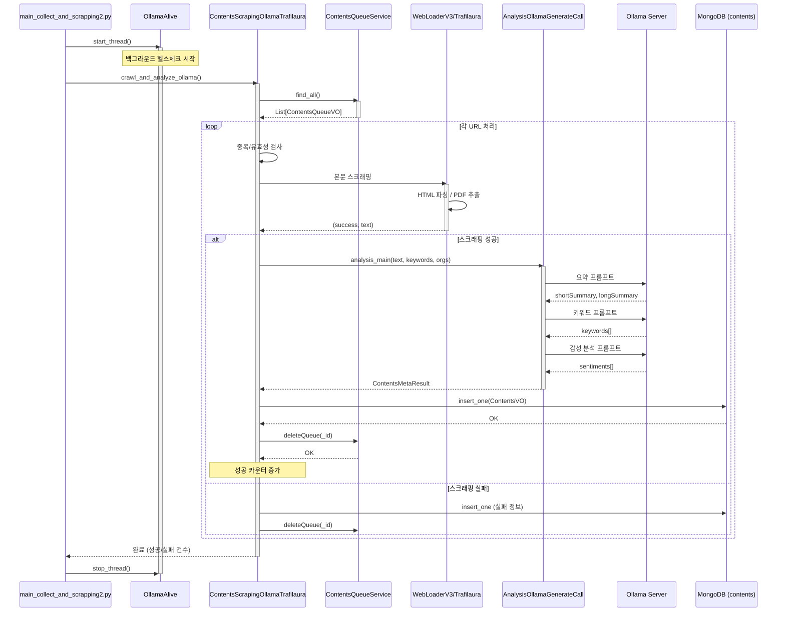
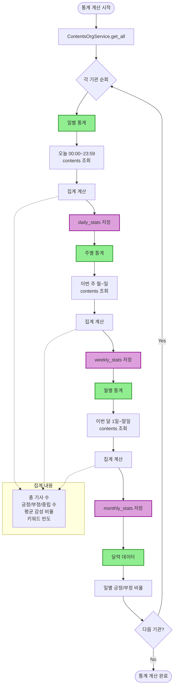

# main_collect_and_scrapping2.py 실행 흐름도

## 전체 파이프라인 구조

```mermaid
flowchart TD
    Start([프로그램 시작]) --> CheckArgs{명령줄 인자<br/>--today-json?}
    
    %% today-json 모드
    CheckArgs -->|Yes| TodayMode[Today JSON 모드]
    TodayMode --> StartOllama1[OllamaAlive 스레드 시작]
    StartOllama1 --> ProcessToday[process_articles_from_today_json]
    ProcessToday --> LoadJSON[today.json 파일 읽기]
    LoadJSON --> ForEachArticle[각 기사 처리]
    ForEachArticle --> ScrapeToday[본문 스크래핑]
    ScrapeToday --> AnalyzeToday[LLM 분석]
    AnalyzeToday --> SaveBackup[contents_backup에 저장]
    SaveBackup --> StopOllama1[OllamaAlive 스레드 종료]
    StopOllama1 --> End1([종료])
    
    %% 전체 파이프라인 모드
    CheckArgs -->|No| FullMode[전체 파이프라인 모드]
    
    %% 1단계: 수집 (주석처리)
    FullMode --> Stage1Comment[1단계: 수집<br/>현재 비활성화]
    Stage1Comment -.->|주석 처리됨| Collect[DockerCollectMain.distribute]
    Collect -.-> CrawlWebsites[정부기관 웹사이트 크롤링]
    CrawlWebsites -.-> SaveQueue[contents_queue에 저장]
    SaveQueue -.-> RemoveDup1[중복 URL 제거]
    
    %% 2단계: 스크래핑 및 분석
    Stage1Comment --> Stage2[2단계: 스크래핑 및 분석<br/>활성화]
    Stage2 --> StartOllama2[OllamaAlive 헬스체크 시작]
    
    StartOllama2 --> GetQueue[contents_queue 조회]
    GetQueue --> CheckEmpty{큐가<br/>비었는가?}
    CheckEmpty -->|Yes| SkipScrape[스크래핑 스킵]
    CheckEmpty -->|No| ForEachQueue[각 URL 순회]
    
    ForEachQueue --> CheckExist{이미<br/>존재?}
    CheckExist -->|Yes| NextURL1[다음 URL]
    CheckExist -->|No| ValidateOrg{기관/카테고리<br/>유효?}
    
    ValidateOrg -->|No| NextURL2[다음 URL]
    ValidateOrg -->|Yes| ScrapeWeb[웹 스크래핑]
    
    ScrapeWeb --> ChooseMethod{수집 방법}
    ChooseMethod -->|PDF| WebLoaderPDF[WebLoaderV3<br/>PDF 처리]
    ChooseMethod -->|HTML/Body| TrafilauraHTML[TrafilauraScraper<br/>본문 추출]
    ChooseMethod -->|Tag| TrafilauraTag[Trafilaura<br/>태그 기반]
    
    WebLoaderPDF --> CheckSuccess{스크래핑<br/>성공?}
    TrafilauraHTML --> CheckSuccess
    TrafilauraTag --> CheckSuccess
    
    CheckSuccess -->|No| SaveFail[실패 정보 저장<br/>rawCollectSucYN=N]
    SaveFail --> DeleteQ1[큐에서 삭제]
    DeleteQ1 --> NextURL3[다음 URL]
    
    CheckSuccess -->|Yes| LLMAnalysis[Ollama LLM 분석]
    LLMAnalysis --> ExtractKeywords[키워드 추출]
    ExtractKeywords --> GenerateSummary[요약 생성]
    GenerateSummary --> SentimentAnalysis[감성 분석]
    SentimentAnalysis --> CheckAnalysis{분석<br/>성공?}
    
    CheckAnalysis -->|Yes| SaveSuccess[contents 저장<br/>metaSucYN=Y]
    CheckAnalysis -->|No| SaveAnalysisFail[contents 저장<br/>metaSucYN=N]
    
    SaveSuccess --> DeleteQ2[큐에서 삭제]
    SaveAnalysisFail --> DeleteQ2
    DeleteQ2 --> IncCounter[성공 카운터 증가]
    IncCounter --> NextURL3
    
    NextURL1 --> CheckMoreURLs{더 많은<br/>URL?}
    NextURL2 --> CheckMoreURLs
    NextURL3 --> CheckMoreURLs
    SkipScrape --> Stage3
    
    CheckMoreURLs -->|Yes| ForEachQueue
    CheckMoreURLs -->|No| LogResults[결과 로깅]
    
    %% 3단계: 재시도
    LogResults --> Stage3[3단계: 재시도 분석<br/>활성화]
    Stage3 --> CalcTimeRange[7시간 전~현재 계산]
    CalcTimeRange --> RetryAnalysis[실패 건 재분석]
    RetryAnalysis --> RerunScrape[crawl_and_analyze_ollama<br/>재실행]
    
    %% 4단계: 통계
    RerunScrape --> Stage4[4단계: 통계 계산<br/>활성화]
    Stage4 --> GetAllOrgs[전체 기관 목록 조회]
    GetAllOrgs --> ForEachOrg[각 기관 순회]
    
    ForEachOrg --> CalcDaily[일별 통계 계산]
    CalcDaily --> CalcWeekly[주별 통계 계산]
    CalcWeekly --> CalcMonthly[월별 통계 계산]
    CalcMonthly --> CalcCalendar[달력 데이터 생성]
    
    CalcCalendar --> SaveStats[daily_stats,<br/>weekly_stats,<br/>monthly_stats 저장]
    SaveStats --> NextOrg{더 많은<br/>기관?}
    
    NextOrg -->|Yes| ForEachOrg
    NextOrg -->|No| StopOllama2[OllamaAlive 스레드 종료]
    
    StopOllama2 --> End2([종료])
    
    %% 스타일링
    classDef activeStage fill:#90EE90,stroke:#228B22,stroke-width:2px
    classDef inactiveStage fill:#FFE4B5,stroke:#FF8C00,stroke-width:2px,stroke-dasharray: 5 5
    classDef decision fill:#87CEEB,stroke:#4682B4,stroke-width:2px
    classDef process fill:#FFB6C1,stroke:#DC143C,stroke-width:2px
    classDef database fill:#DDA0DD,stroke:#8B008B,stroke-width:2px
    
    class Stage2,Stage3,Stage4,StartOllama1,StartOllama2 activeStage
    class Stage1Comment,Collect,CrawlWebsites,SaveQueue,RemoveDup1 inactiveStage
    class CheckArgs,CheckEmpty,CheckExist,ValidateOrg,ChooseMethod,CheckSuccess,CheckAnalysis,CheckMoreURLs,NextOrg decision
    class ScrapeWeb,LLMAnalysis,ExtractKeywords,GenerateSummary,SentimentAnalysis process
    class SaveQueue,SaveSuccess,SaveFail,SaveBackup,SaveStats database
```

---

## 데이터 흐름도 (MongoDB 컬렉션 중심)

---

## 모듈 간 의존성 다이어그램

```mermaid
graph TB
    subgraph Main[main_collect_and_scrapping2.py]
        MainScript[메인 스크립트]
    end
    
    subgraph Collect[수집 모듈]
        DockerCollect[DockerCollectMain]
        RSS[RSSCollector]
        Selenium[SeleniumCollector]
        OpenAPI[OpenAPICollector]
    end
    
    subgraph Scraping[스크래핑 모듈]
        ContentsScraping[ContentsScrapingOllamaTrafilaura]
        WebLoader[WebLoaderV3]
        Trafilaura[TrafilauraScraper]
    end
    
    subgraph Analysis[분석 모듈]
        OllamaAnalysis[AnalysisOllamaGenerateCall]
        OllamaAlive[OllamaAlive]
        ChatOllama[ChatOllama<br/>langchain_ollama]
    end
    
    subgraph Services[DB 서비스]
        QueueService[ContentsQueueService]
        ContentsService[ContentsService]
        StatsService[StatsService]
        OrgService[ContentsOrgService]
        CalendarService[CalendarService]
    end
    
    subgraph Database[MongoDB]
        MongoDB[(MongoDB<br/>mycontents DB)]
    end
    
    subgraph External[외부 서비스]
        OllamaServer[Ollama Server<br/>:11434]
        TelegramAPI[Telegram API]
    end
    
    subgraph Utils[유틸리티]
        Logger[Logger]
        Config[Config]
    end
    
    %% 의존성 관계
    MainScript --> DockerCollect
    MainScript --> ContentsScraping
    MainScript --> OllamaAlive
    MainScript --> StatsService
    MainScript --> CalendarService
    MainScript --> OrgService
    MainScript --> Logger
    
    DockerCollect --> RSS
    DockerCollect --> Selenium
    DockerCollect --> OpenAPI
    DockerCollect --> QueueService
    DockerCollect --> OrgService
    
    ContentsScraping --> WebLoader
    ContentsScraping --> Trafilaura
    ContentsScraping --> OllamaAnalysis
    ContentsScraping --> QueueService
    ContentsScraping --> ContentsService
    ContentsScraping --> OrgService
    
    OllamaAnalysis --> ChatOllama
    OllamaAlive --> TelegramAPI
    
    QueueService --> MongoDB
    ContentsService --> MongoDB
    StatsService --> MongoDB
    OrgService --> MongoDB
    CalendarService --> MongoDB
    
    ChatOllama --> OllamaServer
    OllamaAlive --> OllamaServer
    
    DockerCollect --> Logger
    ContentsScraping --> Logger
    OllamaAlive --> Logger
    
    DockerCollect --> Config
    ContentsScraping --> Config
    OllamaAnalysis --> Config
    OllamaAlive --> Config
    
    %% 스타일
    classDef mainClass fill:#FF6B6B,stroke:#C92A2A,stroke-width:3px,color:#fff
    classDef moduleClass fill:#4ECDC4,stroke:#0B7285,stroke-width:2px
    classDef serviceClass fill:#95E1D3,stroke:#087F5B,stroke-width:2px
    classDef dbClass fill:#DDA0DD,stroke:#8B008B,stroke-width:3px
    classDef externalClass fill:#FFD93D,stroke:#F59F00,stroke-width:2px
    
    class MainScript mainClass
    class DockerCollect,ContentsScraping,OllamaAnalysis,OllamaAlive moduleClass
    class QueueService,ContentsService,StatsService,OrgService,CalendarService serviceClass
    class MongoDB dbClass
    class OllamaServer,TelegramAPI externalClass
```

---

## 단계별 상세 시퀀스 다이어그램

### 2단계: 스크래핑 및 분석 상세 흐름

---

## 통계 계산 흐름

---

## 범례 (Legend)

- 🟢 **활성화된 단계**: 현재 코드에서 실행되는 부분
- 🟠 **비활성화된 단계**: 주석 처리되어 실행되지 않는 부분
- 🔵 **조건 분기**: if/else 등 조건에 따라 달라지는 흐름
- 🔴 **외부 의존성**: MongoDB, Ollama Server 등 외부 서비스
- 🟣 **데이터베이스**: MongoDB 컬렉션

---

이상으로 `main_collect_and_scrapping2.py`의 전체 흐름을 시각화했습니다.
